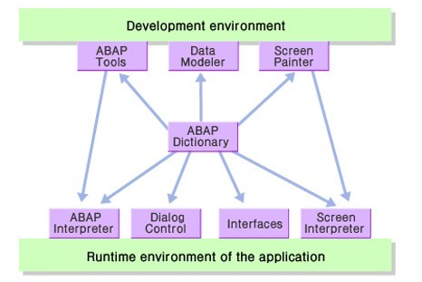

# ABAP Dictionary

시스템 내에서 사용하는 모든 DATA를 정의 및 관리한다.

주요 기능은 아래와 같다.

- ABAP Workbench Tool을 이용한 모든 개발환경에서의 Object들은 ABAP Dictionary의 Object들을 어디서나 참조 가능
- ABAP Dictionary에서 생성 또는 변경된 모든 information은 모든 시스템의 component에 자동으로 제공
- Data integrity, data consistency, data security를 보장
- ABAP Workbench의 모든 구성요스들은 ABAP Dictionary에 저장된 Data에 자유롭게 접근이 가능
- 개발자는 이러한 ABAP Dictionary의 data를 이용하여 실제 Database의 Table or View와 일치하는 Object를 ABAP Dictionary에서 정의가 가능하게 됨

