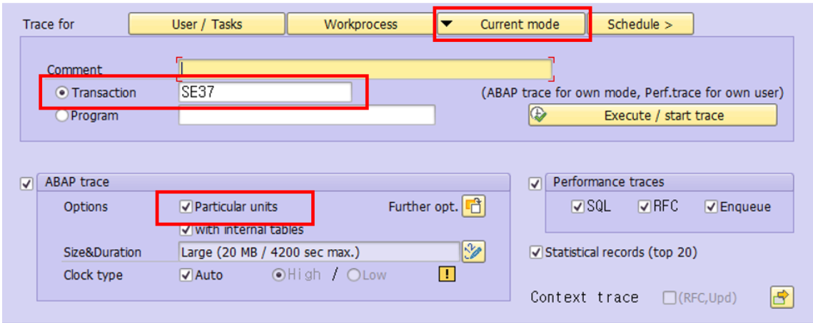
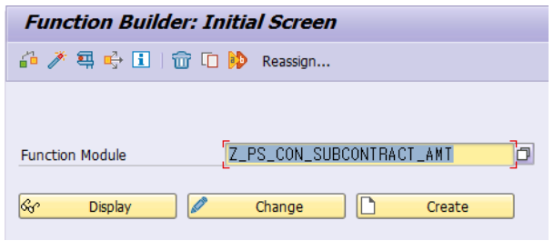
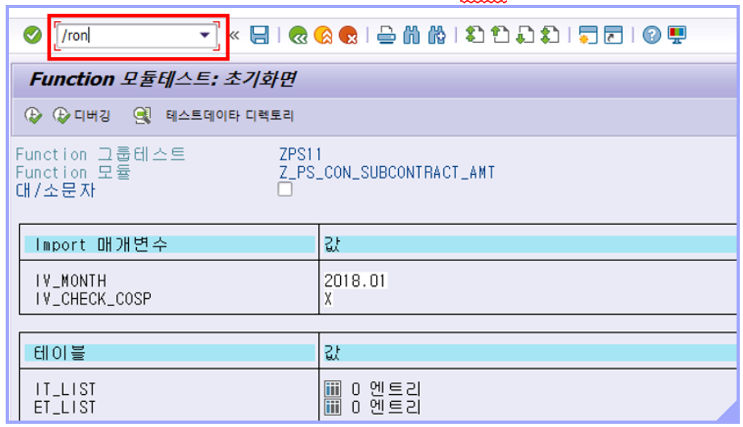

# Function Module 튜닝

1. ST12 실행

2. 아래 사진처럼 설정 후 Execute

 
3. FC 이름 넣고 F8

 
4. 테스트 케이스 값 다 넣고 t코드에 /ron 넣고 엔터

 
5. 밑에 설정 메세지 뜬 후 F8로 실행

6. 결과 나오면 t코드에 /roff 넣고 엔터(나는 치면 에러메세지 떴음 그래도 측정은 됨)

7. F3으로 ST12까지 돌아가기

8. 뒤에는 프로그램 튜닝이랑 똑같음
