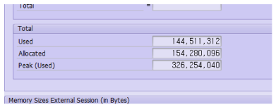

#측정

 

 
used => 현재시점
allocated => 힙 영역에서 동적으로 추가되는 거
peak => 실행되는 동안 가장 많이 잡아먹는 부분
 
결론: peak부분만 잡으면 되는거! 그래서 내가 첨에 잘못 알려줬는데 마지막 부분 놓고 하지말고 로직마다 얼마나 잡아먹는지를 확인해야 하는데 사실상 시간 튜닝 기준으로 하면 peak used가 자동으로 잡혀서 메모리 튜닝 저 툴은 사용 안해도 될듯.
 
진짜 결론: 시간 튜닝을 (ST12) 기준으로 튜닝하고 반영하고 나서 최종적인 memory usage만 KEQ에서 확인하면 될듯! 그리고 peak used 만 줄어드는거 맞음! 메모리를 가비지 컬렉터가 반환해줘서 메모리 사용량이 차곡차곡 쌓이는게 아님.
 
* 정정- 가비지 컬렉터가 안해줘도 보통 서브루틴 실행시점에서는 로컬 변수 선언해서 메모리 잡고 서브루틴이 끝나면 메모리 반환. 가비지 컬렉터는 객체에 관한 메모리 반환!