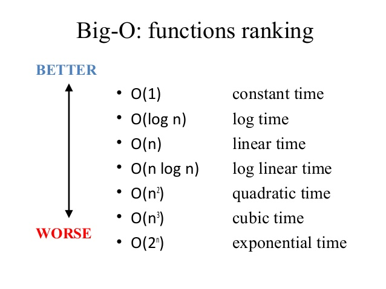
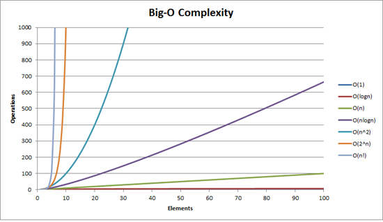

# 시간복잡도(Time Complexity)

### 1. 시간 복잡도

코딩테스트에서 시간 복잡도는 문제를 어떻게 풀어나가야 하는지를 결정하는 중요한 지표다.

시간 복잡도(time complexity)란 가장 널리 사용되는 알고리즘의 수행 시간 기준으로, **알고리즘이 실행되는 동안 수행하는 기본적인 연산의 수를 입력의 크기에 대한 함수로 표현한 것**이다.

기본적인 연산이란 더 이상 쪼갤 수 없는 최소 크기의 연산으로 기본적인 `사칙연산`, `대소 비교`, `변수 대입` 등이 그러하다.

반면 `정렬`, `소인수 분해` 등은 반복문을 포함한 연산이기 때문에 기본적인 연산이라 할 수 없다.

하지만 알고리즘 한 문제를 풀더라도 그 안에는 수 많은 기본 연산들이 포함되어 있다.

그걸 일일히 다 세는 것은 시간 복잡도를 구하다가 시간을 다 날려먹는 일이다.

그래서 우리는 시간을 많이 잡아 먹을 것 같은 큼직한 연산들만 생각해야 한다.

서울에서 부산까지 자동차를 타고 간다고 생각해 보자.

아래와 같은 두 종류의 자동차가 준비되어 있다.

|          항목           | 자동차 A | 자동차 B |
| :---------------------: | :------: | :------: |
|     시동 거는 시간      |   3분    |   5초    |
|     문 여닫는 시간      |   1분    |   0초    |
| 사이드 미러 맞추는 시간 |   5분    |   0초    |
| 좌석 & 등받이 조절 시간 |   4분    |   0초    |
|        최대 시속        | 200km/h  |  40km/h  |

사실 자동차 B는 자전거다.

시동을 걸고, 좌석을 조절하는 시간이 덜 든다고 해서 최고 속도에서 압도적인 차이가 나는 자전거를 타고 서울에서 부산을 갈 사람은 없을 것이다. 몇 시간의 긴 여정에 비해 10분 남짓의 시간은  무시해도 상관 없을 만큼 작은 시간이다.

알고리즘의 수행 시간에서 최대 시속처럼 전체 시간을 좌지우지할 요소는 무엇일까?

바로 **반복문**이다.

자전거가 짧은 거리에서는 자동차 보다 빠를 수 있는 것처럼 입력의 크기가 작을 때는 반복문 외의 다른 부분들이 갖는 비중이 클 수 있지만, 입력의 크기가 커지면 커질수록 반복문이 알고리즘의 수행 시간을 지배하게 된다.

따라서 우리는 알고리즘의 수행 시간을 반복문이 수행되는 횟수로 측정한다. 그리고 그 반복문의 수행 횟수는 입력의 크기에 대한 함수로 표현한다.

### 2. 빅오 표기법(Big-O Notation)

위와 같은 노력에도 실제로 알고리즘 문제를 풀다보면 수 많은 반복문들을 만나게 된다.

자잘한 반복문들을 다 생각하여 시간 복잡도를 계산하는 것 또한 여간 복잡하고 번거로운 일이 아니다.

빅 오 표기법은 반복문 중에서도 **가장 빨리 증가하는 항만을 남긴 채 나머지를 다 버리는 표기법**이다.

예를 들어 `3N² - 16N + 7` 이라는 알고리즘 수행시간이 나온다면 빅 오 표기법으로는 **N²**이 반환된다. 그리고 그 알고리즘의 수행 시간은 *O(N²)*이라고 표현한다.

빅 오 표기법의 수행시간은 아래와 같은 순으로 빠른 성능을 나타낸다.

### 

###             

