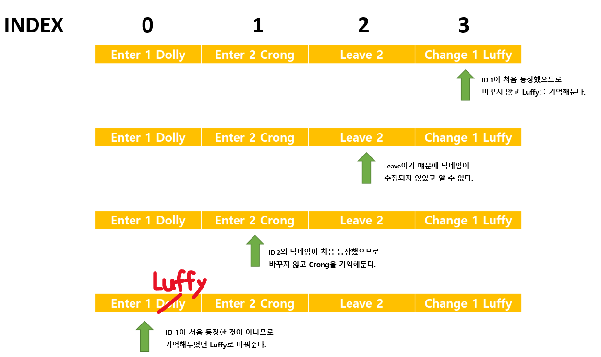
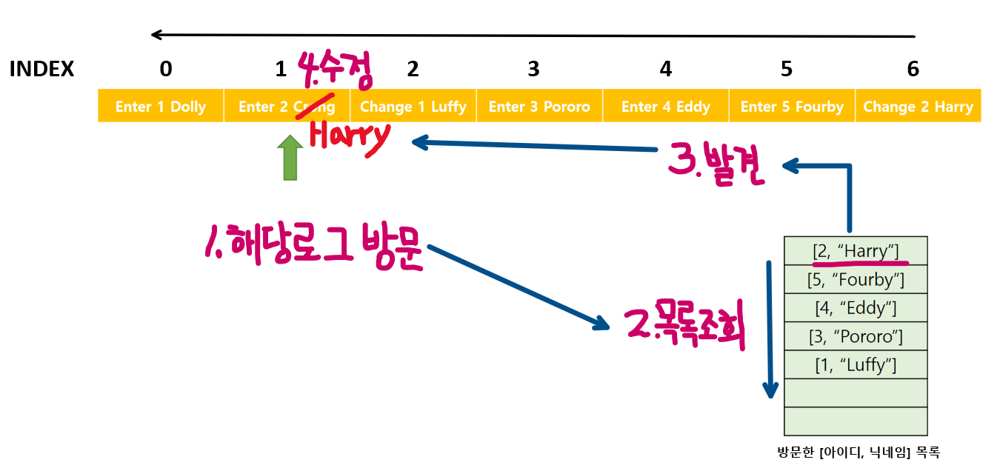
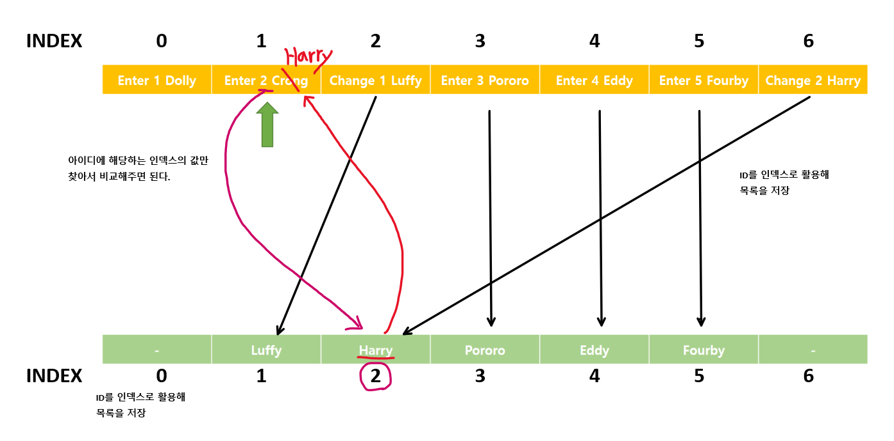
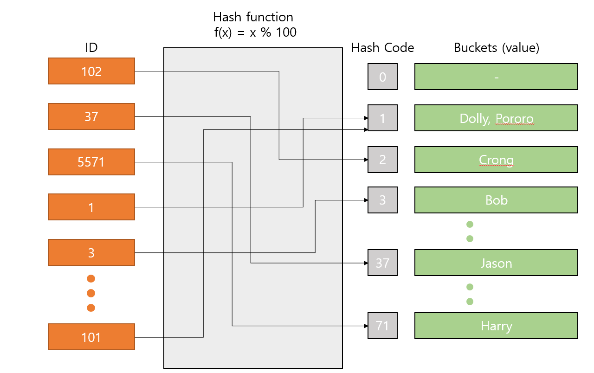
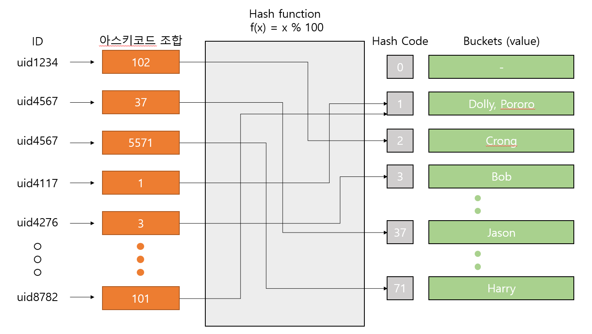

# [프로그래머스] 오픈채팅방 의식의 흐름 & Hash map

### 문제 설명
```
카카오톡 오픈채팅방에서는 친구가 아닌 사람들과 대화를 할 수 있는데, 본래 닉네임이 아닌 가상의 닉네임을 사용하여 채팅방에 들어갈 수 있다.
신입사원인 김크루는 카카오톡 오픈 채팅방을 개설한 사람을 위해, 다양한 사람들이 들어오고, 나가는 것을 지켜볼 수 있는 관리자창을 만들기로 했다. 채팅방에 누군가 들어오면 다음 메시지가 출력된다.

[닉네임]님이 들어왔습니다.

채팅방에서 누군가 나가면 다음 메시지가 출력된다.

[닉네임]님이 나갔습니다.

채팅방에서 닉네임을 변경하는 방법은 다음과 같이 두 가지이다.

채팅방을 나간 후, 새로운 닉네임으로 다시 들어간다.
채팅방에서 닉네임을 변경한다.
닉네임을 변경할 때는 기존에 채팅방에 출력되어 있던 메시지의 닉네임도 전부 변경된다.

예를 들어, 채팅방에 Muzi와 Prodo라는 닉네임을 사용하는 사람이 순서대로 들어오면 채팅방에는 다음과 같이 메시지가 출력된다.

Muzi님이 들어왔습니다.
Prodo님이 들어왔습니다.

채팅방에 있던 사람이 나가면 채팅방에는 다음과 같이 메시지가 남는다.

Muzi님이 들어왔습니다.
Prodo님이 들어왔습니다.
Muzi님이 나갔습니다.

Muzi가 나간후 다시 들어올 때, Prodo 라는 닉네임으로 들어올 경우 기존에 채팅방에 남아있던 Muzi도 Prodo로 다음과 같이 변경된다.

Prodo님이 들어왔습니다.
Prodo님이 들어왔습니다.
Prodo님이 나갔습니다.
Prodo님이 들어왔습니다.

채팅방은 중복 닉네임을 허용하기 때문에, 현재 채팅방에는 Prodo라는 닉네임을 사용하는 사람이 두 명이 있다. 이제, 채팅방에 두 번째로 들어왔던 Prodo가 Ryan으로 닉네임을 변경하면 채팅방 메시지는 다음과 같이 변경된다.

Prodo님이 들어왔습니다.
Ryan님이 들어왔습니다.
Prodo님이 나갔습니다.
Prodo님이 들어왔습니다.

채팅방에 들어오고 나가거나, 닉네임을 변경한 기록이 담긴 문자열 배열 record가 매개변수로 주어질 때, 모든 기록이 처리된 후, 최종적으로 방을 개설한 사람이 보게 되는 메시지를 문자열 배열 형태로 return 하도록 solution 함수를 완성하라.

제한사항
record는 다음과 같은 문자열이 담긴 배열이며, 길이는 1 이상 100,000 이하이다.
다음은 record에 담긴 문자열에 대한 설명이다.
모든 유저는 [유저 아이디]로 구분한다.
[유저 아이디] 사용자가 [닉네임]으로 채팅방에 입장 - Enter [유저 아이디] [닉네임] (ex. Enter uid1234 Muzi)
[유저 아이디] 사용자가 채팅방에서 퇴장 - Leave [유저 아이디] (ex. Leave uid1234)
[유저 아이디] 사용자가 닉네임을 [닉네임]으로 변경 - Change [유저 아이디] [닉네임] (ex. Change uid1234 Muzi)
첫 단어는 Enter, Leave, Change 중 하나이다.
각 단어는 공백으로 구분되어 있으며, 알파벳 대문자, 소문자, 숫자로만 이루어져있다.
유저 아이디와 닉네임은 알파벳 대문자, 소문자를 구별한다.
유저 아이디와 닉네임의 길이는 1 이상 10 이하이다.
채팅방에서 나간 유저가 닉네임을 변경하는 등 잘못 된 입력은 주어지지 않는다.
```

### 0. 먼저 생각해보기
---

알고리즘의 기본은 완전탐색, 즉 **모든 경우의를수를 따지는 것**이다. 

기업 코딩 테스트를 기준으로, 거의 모든 문제들은 **'어떻게 완전탐색을 쓸까?'** 또는 **'어떻게 완전탐색을 안 쓸까?'** 로 나뉜다.

그리고 그것을 나누는 기준은 시간복잡도(Big-O)이다. [빅오표기법 정리](https://www.youtube.com/watch?v=6Iq5iMCVsXA)

모든 경우를 따져봤을 때, 그 수가 크지 않아서 다 돌려볼만 하면 어떻게 완전탐색을 구현할지 생각해야 한다.  

```bfs```, ```dfs```, ```백트래킹``` 등이 완전탐색을 돌리는 방법들이다.

개인적인 경험으로는 10만 단위까지는 완전탐색을 선호하고, 100만도 다른 방법이 생각나지 않으면 시도해볼만 하다. 천만이 넘어가면 살짝 불안해지기 시작, 억단위가 되면 완전탐색이 아닌 다른 방법을 찾는다. 물론 문제의 조건과 제한사항에 따라 그 기준은 절대적이지 않다.

그렇게 경우의 수를 따졌을 때, 와 이건 안되겠다 싶으면 이제 '어떻게 완전탐색을 안 쓸까'를 고민해야 한다.

모든 경우의 수를 돌지 않을 규칙을 찾거나, 중복된 계산은 결과를 저장하여 재활용하는 방법들이 그것이다.

```투포인터```, ```다이나믹 프로그래밍```, ```다익스트라 알고리즘``` 등이 완전탐색을 피하기위한 알고리즘이다.

문제를 보고 완전탐색을 쓸지 말지의 여부를 결정, 그리고 그 안에서 어떤 구현 알고리즘(또는 자료구조)을 사용할지가 문제를 해결하는데 있어서 중요한 키포인트다.

<br>

### 1. 문제 분석
---

입력은 ```[행위, 아이디, 닉네임]```으로 주어지고 닉네임을 바꿀 때마다 해당하는 모든 아이디의 닉네임을 바꾸어줘야 한다. 닉네임이 바뀌는 행위는 ```Change```와 ```Enter```이다.

결과는 모든 변경사항이 적용된 최종 로그를 출력하는 것이다. 그렇기 때문에 어렵게 생각할거 없이 **마지막으로 수정한 닉네임을 모든 로그에 적용**시키면 간단하게 해결된다.

마지막부터 순차적으로 로그를 확인하면서 해당 아이디가 첫번째로 등장했다면 그대로 두고, 그렇지 않다면 처음 등장했던 아이디의 닉네임으로 현재 로그의 닉네임을 바꿔준다.



로직은 위와 같이 간단하다. 여기서 우리가 생각해봐야할 것은 **어떻게 처음등장했는지 여부를 확인하는가**이다.

가장 직관적이고 단순한 방법은 배열을 하나 만들고 매 로그를 지날 때마다 배열을 검사하여 해당 아이디가 등장했던 적이 있으면 찾아서 바꿔주고, 그렇지 않다면 배열에 저장하는 방식이다.



하지만 위와 같은 방법은 매 로그를 지날 때마다 방문목록을 순서대로 뒤져서 아이디의 존재 여부를 찾아야 한다.

문제에서 입력 로그가 10만개까지 주어질 수 있다고 했기 때문에 10만개의 레코드를 돌면서 목록을 조회,

거기다가 10만개가 모두 다른 아이디일 경우에는 방문목록을 처음부터 끝까지 매번 다 돌고(없다는 것을 확인하기 위해) 추가를 해줘야 한다. 마지막 10만번 째 로그를 확인할 때는 방문목록에 있는 9만9999개의 레코드를 다 확인하고 추가 한다. 즉, 완전탐색을 진행한다는 말이다.

O(n^2)의 시간복잡도로 약 100억 번의 어마무시한 연산이 필요하고 우린 새로운 방법을 찾아야 한다.

가장 효율적인 방법은 **ID를 인덱스로 활용하여 목록을 저장**하는 것이다. 그렇게 되면 해당 ID와 일치하는 목록 인덱스의 값만 비교해주면 된다.



위와 같은 방법으로 한다면 단 한번의 연산으로 해당 목록을 찾아 비교할 수 있다. 

ID가 2이고 방문목록 배열이 visit라고 한다면, visit[2]의 값을 확인하는 것만으로 해당 ID가 첫방문인지, 그렇지 않다면 해당하는 닉네임이 무엇인지를 알 수 있다. 최악의 경우인 10만개의 로그가 입력으로 들어와도, 10만 번의 시간복잡도로 문제를 해결할 수 있다.

하지만 위와 같은 방식에도 단점은 존재한다. 미리 visit 배열을 로그의 갯수만큼 할당을 해주어야하고(최대 10만개), 지금까지 들었던 예에서는 ID 값이 숫자였지만 실제 문제에서는 ```10자리 이하의 문자열```이다. 

그렇기 때문에 우리는 ```Hash map```이라는 자료구조를 사용하여 문제를 해결할 것이다.

<br>

### 2. Hash map
---


*출처: 위키피디아*

해시맵은 키(key)와 값(value)로 이루어져 그 둘을 매핑하여 저장하는 자료구조이다. 

검색하고자하는 키 값을 입력 받으면 **해시 함수**를 돌려서 반환받은 **해시 코드**를 배열의 **인덱스**로 환산을 해서 값(데이터)에 접근하는 방식이다.

>f(key) -> HashCode -> Index -> Value

여기서 사용하는 키 값은 문자열이 될 수도 있고 숫자가 될 수도 있다. 사용하기 나름이다.

우리의 문제에 대입하여 생각해보자. 두 번째 방법인 인덱스를 활용한 방문여부 확인 방식에는 두 가지 한계가 있었다.

- 입력 로그의 수만큼 비효율적으로 메모리를 미리 할당해야 한다.

- 자연수가 아닌 ID는 인덱스로 활용할 수 없어서 문자열 입력에 적용할 수 없다.

해시맵일 경우 ```Hash function```을 사용하여 두 문제를 해결한다.

해시함수의 예로 많이 쓰이고 가장 간단한 나머지 연산을 사용한다고 생각해보자.

>f(id) = id % 100

위와 같은 해시함수를 활용한다면 10만개의 로그가 입력으로 들어온다 해도 100개의 배열로 값을 저장할 수 있다.



물론 10만개의 배열을 만들었을 때 보다는 성능이 살짝 떨어진다. 위의 그림에서도 ```Hash code```가 1인 경우가 두개로 버킷 안에 두 개의 데이터가 들어가 있다. 그래서 해당 버킷 안에서도 값을 다시 값을 찾는데  오버헤드가 발생한다. (*Hash algorithm collision*)

하지만 각 언어별 사용하는 hash map 라이브러리에서 이러한 처리를 최대한 효율적으로 분배하기 떄문에(hash function이 값을 얼마나 골고루 분배하도록 짜는가가 품질을 결정한다) hash map의 시간복잡도는 대게 ```O(1)```로 취급한다.

그렇다면 ID가 문자열인 경우에는 어떻게 처리할까?

그것도 Hash function을 어떻게 짜느냐로 해결할 수 있다. 각 문자는 정수값인 ```아스키코드```를 갖고 있으며 이러한 아스키코드의 조합으로 key값을 구성, hash function을 사용하여 hash code를 생성함으로 키값이 문자열이여도 상관없이 처리한다.




아스키 코드를 어떻게 조합했는지 표현할까 했지만 다시 그리기 너무 귀찮아서 위의 그림을 조금 바꿔 사용했다.

아무튼 문자열 ID를 어떻게 어떻게 변형하여 hash code로 사용할 수 있다는게 요지다.

<br>

### 3. 결론
---

해시맵을 써서 풀면 쉽고 여유롭게 풀 수 있다.

해시맵은 각 언어별로

```C++ STL에서는 unordered_map```

```Java에서는 HashMap```

```Python에서는 dictionary```

```Javascript에서는 array컨테이너```
를 활용하여 사용할 수 있다. 

*[자바스크립트 hash map 사용법](https://codingcoding.tistory.com/1006)*

<br>

>참고 사이트 <br>
https://www.youtube.com/watch?v=Vi0hauJemxA
