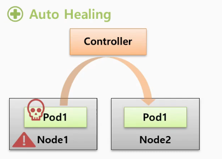
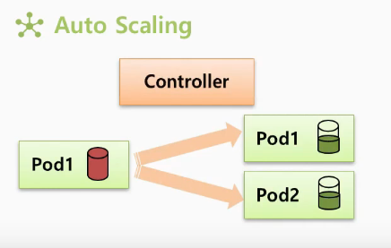
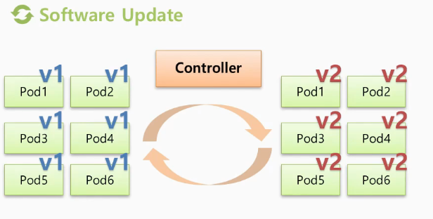
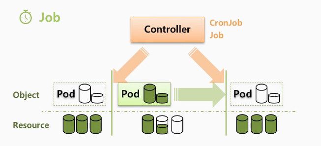

# Controller

---

쿠버네티스의 컨트롤러는 서비스를 관리하고 운영하는데 도움을 주는 역할을 한다.

크게 **Auto Healing, Auto Scaling,  Software Update, Job** 네 가지 기능을 지원한다.

 

### 1. Auto Healing

---

노드 위에 존재하는 파드 또는 노드 자체가 다운되었을 때, 서비스에 장애가 발생할 수 있다.

컨트롤러는 이러한 장애사항을 즉각적으로 인지하고 파드를 다른 노드에 새로 만들어준다.

이것을 auto healing 기능이라 한다.

### 2. Auto Scaling

---

파드의 리소스가 한계치에 도달했을 때, 컨트롤러는 이 상태를 파악하고 파드를 추가로 더 만들어 줌으로써 부하를 분산시키고 파드가 죽지 않도록 해준다.

그렇게 서비스가 성능에 대한 장애없이 안정적인 서비스를 운영하도록 도와주는 것이 auto scaling 기능이다.

### 3. Software Update

---

여러 파드에 대한 버전 업그레이드가 필요할 때 컨트롤러를 통해서 한 번에 쉽게 업그레이드가 가능하다.

또한 업그레이드 도중에 문제가 발생하면 롤백 기능도 제공한다.

### 4. Job

---

일시적인 작업을 해야할 경우, 컨트롤러가 필요한 순간에만 파드를 생성하여 해당 작업을 이행 후 파드를 삭제한다.

작업 순간에만 자원이 할당되고 작업이 끝나면 반환되기 때문에 효율적인 작업을 수행할 수 있다.

