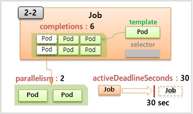
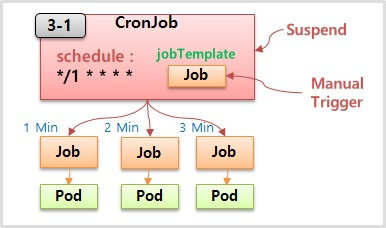

# Controller - DaemonSet & Job

---


### 1. Daemon Set

---

기존의 ReplicaSet의 경우 node에 존재하는 리소스에 따라 pod들을 생성하였다.

자원이 많이 남는 node는 더 많은 pod를, 적게 남은 node는 더 적은 pod를 생성하는 식이었다.

그에 반해, **daemon set**은 node의 리소스 여부와는 상관 없이 하나의 pod를 node 별로 생성한다.

Node 별로 하나씩의 pod가 필요할 때 daemon set을 많이 사용하는데 그 대표적인 예가

- 각 node들의 성능을 모니터링 해야할 때 (ex. Prometheus)
- 특정 노드에 장애가 발생할 경우 log를 수집하기 위해 (ex. fluentd)
- 노드들을 storage로써 사용할 때 (ex. GlusterFS)

등이 있다.


**1-1) DaemonSet - HostPort**

```yaml
apiVersion: apps/v1
kind: DaemonSet
metadata:
  name: daemonset-1
spec:
  selector:
    matchLabels:
      type: app
  template:
    metadata:
      labels:
        type: app
    spec:
      containers:
      - name: container
        image: kubetm/app
        ports:
        - containerPort: 8080
          hostPort: 18080
```


**Command**

```bash
curl 192.168.0.31:18080/hostname
```


**1-2) DaemonSet - NodeSelector**

```yaml
apiVersion: apps/v1
kind: DaemonSet
metadata:
  name: daemonset-2
spec:
  selector:
    matchLabels:
      type: app
  template:
    metadata:
      labels:
        type: app
    spec:
      nodeSelector:
        os: centos
      containers:
      - name: container
        image: kubetm/app
        ports:
        - containerPort: 8080
```


**Kubectl**

*Label Add*

```bash
kubectl label nodes k8s-node1 os=centos
kubectl label nodes k8s-node2 os=ubuntu
```

*Label Remove*

```bash
kubectl label nodes k8s-node2 os-
```


### 2. Job & CronJob

---


**2-1) Job1**

```yaml
apiVersion: batch/v1
kind: Job
metadata:
  name: job-1
spec:
  template:
    spec:
      restartPolicy: Never
      containers:
      - name: container
        image: kubetm/init
        command: ["sh", "-c", "echo 'job start';sleep 20; echo 'job end'"]
      terminationGracePeriodSeconds: 0
```





**2-2) Job2**

```yaml
apiVersion: batch/v1
kind: Job
metadata:
  name: job-2
spec:
  completions: 6
  parallelism: 2
  activeDeadlineSeconds: 30
  template:
    spec:
      restartPolicy: Never
      containers:
      - name: container
        image: kubetm/init
        command: ["sh", "-c", "echo 'job start';sleep 20; echo 'job end'"]
      terminationGracePeriodSeconds: 0
```


### 3. Cron Job

---




**3-1) Cron Job**

```yaml
apiVersion: batch/v1beta1
kind: CronJob
metadata:
  name: cron-job
spec:
  schedule: "*/1 * * * *"
  jobTemplate:
    spec:
      template:
        spec:
          restartPolicy: Never
          containers:
          - name: container
            image: kubetm/init
            command: ["sh", "-c", "echo 'job start';sleep 20; echo 'job end'"]
          terminationGracePeriodSeconds: 0
```


**Kubectl**

```bash
kubectl create job --from=cronjob/cron-job cron-job-manual-001
```


**Suspend**

```bash
kubectl patch cronjobs cron-job -p '{"spec" : {"suspend" : false }}'
```

