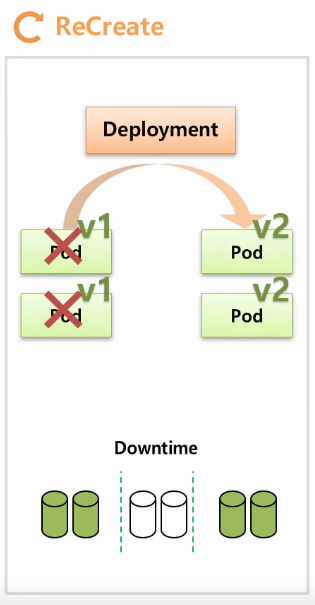
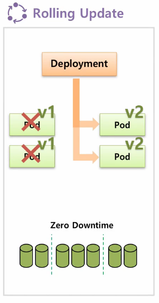
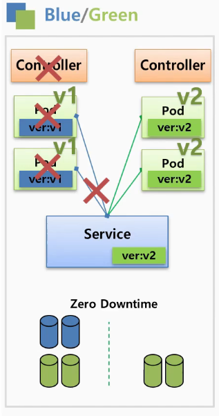

# Version update

---

쿠버네티스에서는 pod의 버전을 업데이트 하는 크게 네 가지 방법이 존재한다.
**ReCreate, Rolling Update, Blud/Green, Canary**가 그 방법들이다.

### 1. ReCreate

---

Deployment 컨트롤러를 통해 v1의 pod들을 제거하고 v2의 pod들을 생성하는 방법이다.

추가 리소스가 필요하지 않고 가장 단순한 방법이지만 서비스에 대한 다운타임이 발생한다는 치명적인 단점이 있다.

그래서 일시적인 정지가 가능한 서비스에 한해서 사용이 가능한 방법이다.

### 2. Rolling Update

---

용어 그대로 회전식 업데이트 방법이다.

V1의 pod들을 종료시키지 않고 추가로 v2의 pod를 생성한 뒤, v1을 죽인다.

즉, v2의 pod가 생성되었을 때는 위의 그림을 기준으로 총 세 개의 pod가 운영되고 있는 상태이며 그 때 들어온 트래픽은 v1의 pod로 들어갈 수도, v2의 pod로 들어갈 수도 있다.

Recreate 방식에 비해 추가적인 자원이 필요하지만 서비스의 중단 없이 버전을 업데이트 할 수 있다는 장점이 있다.

### 3. Blue/Green

---

새로운 버전의 pod들을 모두 생성한 뒤, service에 label을 바꾸어 한 번에 모든 pod들의 버전을 업데이트 하는 방식이다.

두 개의 컨트롤러로 pod들을 관리하며 , 자원이 pod의 갯수보다 두 배나 더 필요하지만 버전을 혼용하여 운영하는 단계가 없이 한 번에 넘어갈 수 있으며 새로운 버전의 pod에 문제가 발생할 경우 서비스에 라벨만 바꿔주는 방식으로 롤백이 간단하다. 

굉장히 안정적인 배포방식이지만 자원이 두 배나 필요하다는 부담은 적지 않다.

### 4. Canary

---

카나리방식은 이름만 들어서는 어떤 방식인지 추측하기 힘들다.

