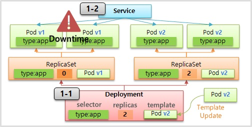
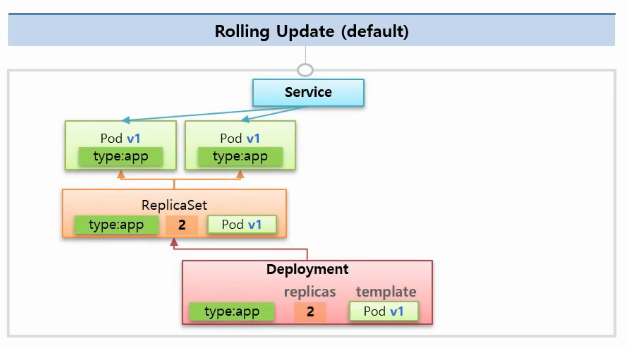
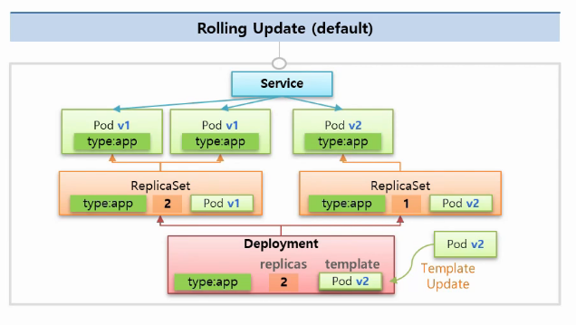
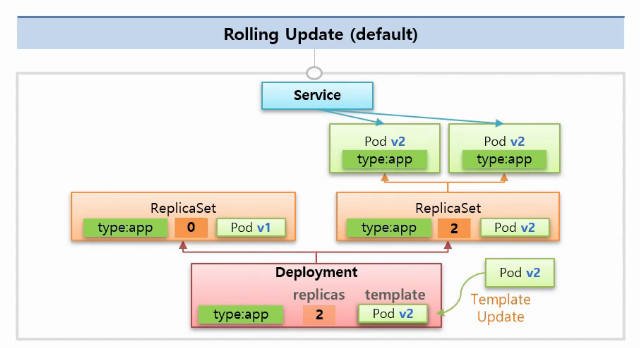

# Deployment - ReCreate & RollingUpdate

---


지난 글에서는 pod의 버전이 업데이트 됨에 따라 재배포를 해야할 경우 네 가지 방법에 대해 알아봤다.

그 중 쿠버네티스에서 ReCreate와 RollingUpdate을 어떻게 사용하는지 알아보자.

### 1.  ReCreate

---




1-1)의 deployment를 생성할 때, replica에서 넣었던 `selector`, `replicas`, `tempalte` 설정 값들은 똑같이 넣는다. 

하지만 deployment가 직접 pod를 만들어서 관리를 하지는 않는다.

Deploymetn의 값들은 replicaSet에서 계승하여 해당 내용대로 pod들을 만든다.

그리고 service를 만들어 label을 통해 연결한다.

V2의 버전으로 업그레이드를 실시한다면 v1을 관리하던 레플리카 셋의 파드 수를 0으로 만들어 준뒤 v2의 레플리카 셋을 만들어 주면 잠깐의 downtime이 발생하지만 service는 기존의 라벨을 따라 새로운 pod들에 연결 된다. 


**1-1) Deployment**

```yaml
apiVersion: apps/v1
kind: Deployment
metadata:
  name: deployment-1
spec:
  selector:
    matchLabels:
      type: app
  replicas: 2
  strategy:
    type: Recreate
  revisionHistoryLimit: 1 # 0인 레플리카 셋을 하나만 남기겠다. 전전 버전은 삭제. default 값은 10.
  template:
    metadata:
      labels:
        type: app
    spec:
      containers:
      - name: container
        image: kubetm/app:v1
      terminationGracePeriodSeconds: 10
```


**1-2) Service**

```yaml
apiVersion: v1
kind: Service
metadata:
  name: svc-1
spec:
  selector:
    type: app
  ports:
  - port: 8080
    protocol: TCP
    targetPort: 8080

```


**Command**

```bash
while true; do curl 10.99.5.3:8080/version; sleep 1; done
```


**Kubectl**

```bash
kubectl rollout undo deployment deployment-1 --to-revision=2
kubectl rollout history deployment deployment-1
```


### 3. Rolling Update

---



초기 서비스를 제공하고 있는 모습이다. 2개의 레플리카셋으로 파드가 두 개 존재한다.




다음 버전인 v2를 deployment의 템플릿에 적용을 시키면 rolling update가 실행된다.

새로운 버전의 pod를 생성하는 replicaSet을 만든다.

Service는 구버전인 v1과 새로운 버전의 v2를 동시에 서비스 한다.

기존의 서비스를 진행할 때보다 하나의 pod가 추가로 필요하다.





V2로 rolling update가 끝난 모습이다. 

구버전인 v1의 레플리카셋의 파드 수를 0으로 설정하고 v2로 서비스들이 운영되고 있다.

ReCreate의 방식과 마찬가지로 이전 버전의 replicaSet은 롤백을 위해 삭제하지 않는다.

**2-1) Deployment**

```yaml
apiVersion: apps/v1
kind: Deployment
metadata:
  name: deployment-2
spec:
  selector:
    matchLabels:
      type: app2
  replicas: 2
  strategy:
    type: RollingUpdate
  minReadySeconds: 10 # 10초의 텀을 주어 과정을 지켜볼 수 있게 한다.
  template:
    metadata:
      labels:
        type: app2
    spec:
      containers:
      - name: container
        image: kubetm/app:v1
      terminationGracePeriodSeconds: 0
```


**Service**

```yaml
apiVersion: v1
kind: Service
metadata:
  name: svc-2
spec:
  selector:
    type: app2
  ports:
  - port: 8080
    protocol: TCP
    targetPort: 8080
```


**Command**

```bash
while true; do curl 10.99.5.3:8080/version; sleep 1; done
```

