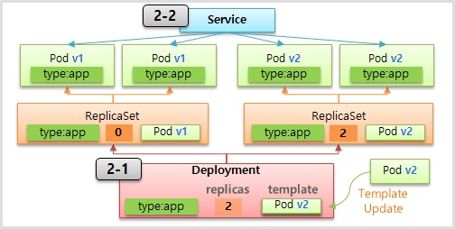

# Deployment - ReCreate & RollingUpdate

---


지난 글에서는 pod의 버전이 업데이트 됨에 따라 재배포를 해야할 경우 네 가지 방법에 대해 알아봤다.

그 중 쿠버네티스에서 ReCreate와 RollingUpdate을 어떻게 사용하는지 알아보자.


### 1.  ReCreate

---


**1-1) Deployment**

```yaml
apiVersion: apps/v1
kind: Deployment
metadata:
  name: deployment-1
spec:
  selector:
    matchLabels:
      type: app
  replicas: 2
  strategy:
    type: Recreate
  revisionHistoryLimit: 1
  template:
    metadata:
      labels:
        type: app
    spec:
      containers:
      - name: container
        image: kubetm/app:v1
      terminationGracePeriodSeconds: 10
```


**1-2) Service**

```yaml
apiVersion: v1
kind: Service
metadata:
  name: svc-1
spec:
  selector:
    type: app
  ports:
  - port: 8080
    protocol: TCP
    targetPort: 8080

```


**Command**

```bash
while true; do curl 10.99.5.3:8080/version; sleep 1; done
```


**Kubectl**

```bash
kubectl rollout undo deployment deployment-1 --to-revision=2
kubectl rollout history deployment deployment-1
```


### 3. Rolling Update

---




**2-1) Deployment**

```yaml
apiVersion: apps/v1
kind: Deployment
metadata:
  name: deployment-2
spec:
  selector:
    matchLabels:
      type: app2
  replicas: 2
  strategy:
    type: RollingUpdate
  minReadySeconds: 10
  template:
    metadata:
      labels:
        type: app2
    spec:
      containers:
      - name: container
        image: kubetm/app:v1
      terminationGracePeriodSeconds: 0
```


**Service**

```yaml
apiVersion: v1
kind: Service
metadata:
  name: svc-2
spec:
  selector:
    type: app2
  ports:
  - port: 8080
    protocol: TCP
    targetPort: 8080
```


**Command**

```bash
while true; do curl 10.99.5.3:8080/version; sleep 1; done
```

