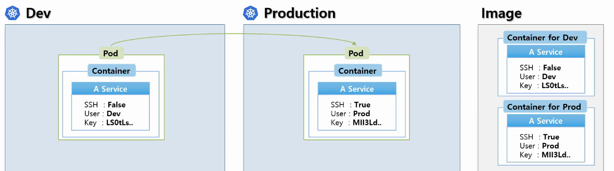
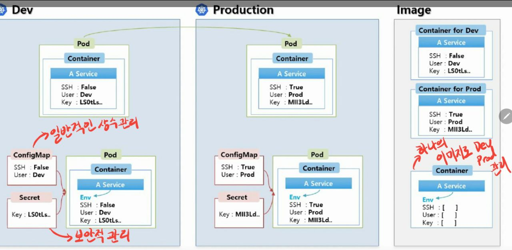
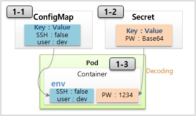
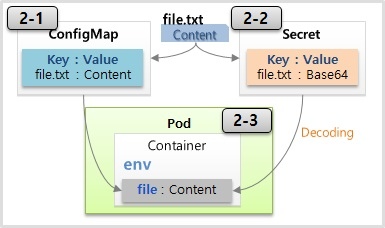

# ConfigMap & Secret

---

상용화되는 거의 모든 서비스들은 개발환경과 상용환경이 분리되어 있다.

K8s에서 각 환경들은 서비스로 이미지화 되어 관리가 되고, 개발환경과 상용환경 모두 각기 다른 이미지가 만들어진다.

이렇게 모든 서비스마다 개발과 상용환경을 나누어 이미지로 관리하는 것은 용량적인 측면부터해서 여간 부담스러운 일이 아니다.

`ConfigMap`과 `Secret`은 환경에 따라 변하는 값들을 외부에서 관리하기 위해 사용된다.

예를 들어, 개발환경에서는 SSH 보안 설정을 사용하지 않고 운영환경에서만 사용한다고 생각해보자.




DEV환경에서는 SSH를 false로 하고, Production환경에서는 true로 설정을 해준다. 또한 user와 key 값 또한 각기 다르게 설정을 해주어야 한다.

하지만 이 소소한 설정들의 차이로 이미지를 따로 생성하여 관리하는 것은 굉장히 비효율적인 일이다.

그래서 공통으로 사용하는 일반적인 상수들을 **configMap**에. key와 같이 보안적인 관리가 필요한 값들은 **secret**에 모아서 외부에서 관리를 한다.

그렇게 각 환경에서 설정한 값들을 pod와 연결함으로서 설정을 유동적으로 해줄 수 있다.




ConfigMap과 secret의 사용법은 데이터를 **상수**로 넣느냐, **파일**로 넣느냐, **volume**으로 넣느냐로 나뉜다.


### 1. Env (Literal)

---

먼저 상수를 통해 데이터를 관리하는 방법이다.

ConfigMap은 key와 value로 구성되어 있다.

그래서 필요한 상수들을 key: value 형태로 저장을 하면 pod를 생성할 때 그 값들을 가져와 환경변수에 세팅을 할 수 있다. 

Secret 또한 똑같은 역할을 하지만 비밀번호나 인증키 등 보안이 필요한 값들을 저장한다.

ConfigMap은 무한히 많은 값을 넣을 수 있고, Secret은 1Mb만 값을 넣을 수 있다.

또한 secret은 memory에서 사용하여 보안적인 우위를 점하지만 많이 생성할수록 성능적인 부분에서 핸디캡이 발생한다.




**ConfigMap**

```yaml
apiVersion: v1
kind: ConfigMap
metadata:
  name: cm-dev
data: #아래와 같이 key, value 형태로 넣어주면 된다.
  SSH: 'false'
  User: dev
```


**Secret**

```yaml
apiVersion: v1
kind: Secret
metadata:
  name: sec-dev
data:
  Key: MTIzNA==
```


**Pod**

```yaml
apiVersion: v1
kind: Pod
metadata:
  name: pod-1
spec:
  containers:
  - name: container
    image: kubetm/init
    envFrom:
    - configMapRef:
        name: cm-dev
    - secretRef:
        name: sec-dev
```


### 2. Env (File)

---

파일을 통해 configMap 또는 secret에 데이터를 담을 수 있다.

그럴 경우 파일의 이름이 데이터의 key가 된다. 설정 yaml파일 내에서 파일의 이름이 아닌 다른 명칭으로 바꿀 수 있다.

File을 configMap으로 만드는 것은 dashboard에서 지원을 해주지 않는다. 

때문에 직접 master의 콘솔로 들어가 cubectl 명령으로 만들어 줘야 한다.


**configMap 생성**

```bash
> echo "Content" >> file-c.txt
> kubectl create configmap cm-file --from-file=./file.txt
```

**secret 생성**

```bash
> echo "Content" >> file-s.txt
> kubectl create secret generic sec-file --from-file=./file-s.txt
```




**Pod**

```yaml
apiVersion: v1
kind: Pod
metadata:
  name: pod-file
spec:
  containers:
  - name: container
    image: kubetm/init
    env:
    - name: file-c #
      valueFrom:
        configMapKeyRef:
          name: cm-file
          key: file-c.txt
    - name: file-s
      valueFrom:
        secretKeyRef:
          name: sec-file
          key: file-s.txt
```


### 3. Volume Mount (File)

---

마지막으로는 file을 마운트하는 방법이다.

위의 2번의 방법과 file을 confgMap에 담는 것까지는 같다.

Pod를 만들 때, 컨테이너 내에서 마운트 패스를 정의하고 그 패스 안에 파일을 마운트하면 된다.

```yaml
apiVersion: v1
kind: Pod
metadata:
  name: pod-mount
spec:
  containers:
  - name: container
    image: kubetm/init
    volumeMounts:
    - name: file-volume
      mountPath: /mount # mount할 패스
  volumes:
  - name: file-volume
    configMap: # volume 내에 configMap을 설정해준다.
      name: cm-file
```


2번(file)과 3번(volume mount) 방식은 한가지 큰 차이가 있는데,

pod를 생성한 뒤 configMap의 내용을 변경하게 된다면 2번 방식은 변경 내용이 반영되지 않지만 3번 방식은 변경 내용이 반영된다.

 2번이 변경되는 경우는 pod가 죽어서 재생성될 경우일 뿐이다.

