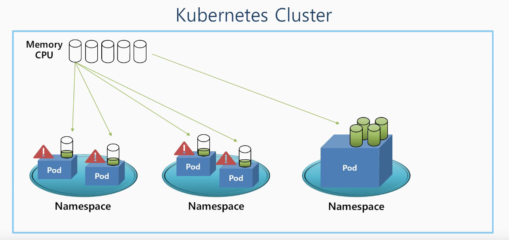
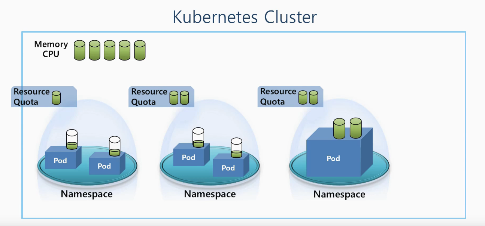
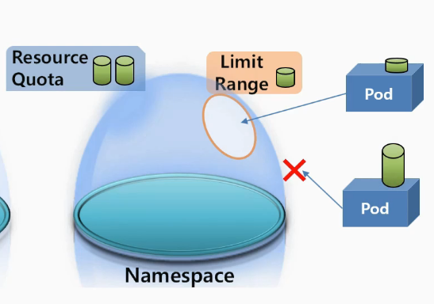
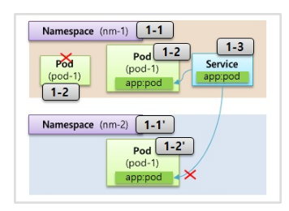
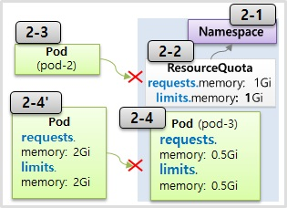
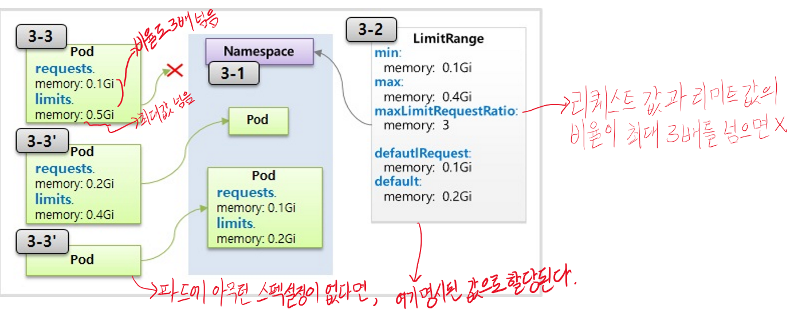

# Namespace & ResourceQuota & LimitRange

---

K8s의 클러스터 내에는 전체 사용할 수 있는 자원이 정해져 있다.

일반적으로 메모리와 CPU가 있다.

그리고 `namespace`라는 것이 존재하며 그 위에 여러 pod들이 존재한다.

Pod들은 필요한 자원을 cluster자원에서 공유하여 사용한다.

하지만 한 namespace에 있는 pod가 클러스터의 모든 자원을 독점해버리면 다른 pod들은 더 이상 쓸 자원이 없어져 문제가 발생한다.




이러한 문제를 해결하기 위해 존재하는 것이 `resource quota`라는 것이다.

Resource quota를 네임스페이스마다 설정하면 각 네임스페이스마다 최대 한도를 설정할 수 있다.

그렇게 되면 한 pod에서 자원이 부족해서 문제가 발생할 수 있지만 그것이 다른 pod들에 영향을 끼치지는 않는다.



또한 하나의 네임스페이스 내에서도 자원 독점의 문제가 발생할 수 있다. 세번 째 네임스페이스처럼 하나의 파드가 할당된 모든 자원을 가져간다면 해당 네임스페이스에서는 더 이상 파드를 생성할 수 없다.

그 때 필요한 것이 `limit range`로 네임스페이스에 들어오는 파드의 최대 크기를 제한하는 것이다.




*`Limit range`와 `Resource Quota`는 네임스페이스에만 다는 것이 아닌 클러스터에 설정하여 클러스터 내부 자원을 관리할 수 있다.*


### 1. Namespace

---

한 네임스페이스 내에서는 **같은 type의 object들은 이름이 중복될 수 없다는 특징**을 갖고 있다.

각 객체마다 고유한 uuid를 갖고 있긴 하지만 한 네임스페이스 안에서는 object의 이름이 key의 역할을 할 수 있다.

또한 네임스페이스는 타 네임스페이스의 자원과 분리가 돼서 관리가 된다.

즉, namespace1에 있는 서비스가 namespace2에 있는 pod로 연결은 불가능하다.

(물론 node나 pv처럼 각 네임스페이스에 공용으로 사용하는 object들도 존재한다)





**1-1 ) Namespace**

```yaml
apiVersion: v1
kind: Namespace
metadata:
  name: nm-1
```


**1-2 ) Pod**

```yaml
apiVersion: v1
kind: Pod
metadata:
  name: pod-1
  namespace: nm-1
  labels:
    app: pod
spec:
  containers:
  - name: container
    image: kubetm/app
    ports:
    - containerPort: 8080
```


**1-3 ) Service**

```yaml
apiVersion: v1
kind: Service
metadata:
  name: svc-1
  namespace: nm-1
spec:
  selector:
    app: pod
  ports:
  - port: 9000
    targetPort: 8080
```


**1-1' ) Namespace** 

```yaml
apiVersion: v1
kind: Namespace
metadata:
  name: nm-2
```


**1-2' ) Pod**

```yaml
apiVersion: v1
kind: Pod
metadata:
  name: pod-1
  namespace: nm-2
  labels:
    app: pod
spec:
  containers:
  - name: container
    image: kubetm/init
    ports:
    - containerPort: 8080
```


### 2. ResourceQuota

---

리소스쿼터는 namespace의 자원의 한계를 정해주는 역할을 한다.

리소스쿼터로 네임스페이스의 할당 자원 한계를 설정한다면 해당 네임스페이스 내에서 pod를 생성할 때, 반드시 필요 자원의 스펙을 명시해야 한다.

명시한 자원들이 리소스쿼터가 할당한 양을 넘어서 생성을 요청하면 파드는 만들어지지 않는다.

제한할 수 있는 자원들은 **Compute Resource**와 **Object의 갯수**이다.

- **Compute Resource** : cpu, memory, storage
- **Object Count** : Pod, Service, ConfigMap, PVC, ... *//버전별로 다르다*




**2-1 ) Namespace**

```yaml
apiVersion: v1
kind: Namespace
metadata:
  name: nm-3
```


**2-2 ) ResourceQuota**

```yaml
apiVersion: v1
kind: ResourceQuota
metadata:
  name: rq-1
  namespace: nm-3
spec:
  hard:
    requests.memory: 1Gi
    limits.memory: 1Gi
```

​	*ResourceQuota Check Command*

> kubectl describe resourcequotas --namespace=nm-3


**2-3 ) Pod**

```yaml
apiVersion: v1
kind: Pod
metadata:
  name: pod-2
spec:
  containers:
  - name: container
    image: kubetm/app
```


**2-4 ) Pod**

```yaml	
apiVersion: v1
kind: Pod
metadata:
  name: pod-3
spec:
  containers:
  - name: container
    image: kubetm/app
    resources:
      requests:
        memory: 0.5Gi
      limits:
        memory: 0.5Gi
```


### 3. LimitRange

---

각각의 파드마다 네임스페이스에 들어갈 수 있는지 자원을 채크해준다.




**3-1 ) Namespace**

```yaml
apiVersion: v1
kind: Namespace
metadata:
  name: nm-5
```

**3-2 ) LimitRange**

```yaml
apiVersion: v1
kind: LimitRange
metadata:
  name: lr-1
spec:
  limits:
  - type: Container
    min:
      memory: 0.1Gi
    max:
      memory: 0.4Gi
    maxLimitRequestRatio:
      memory: 3
    defaultRequest:
      memory: 0.1Gi
    default:
      memory: 0.2Gi
```

​	*LimitRagne Check Command*

> kubectl describe limitranges --namespace=nm-5


**3-3 ) Pod**

```yaml
apiVersion: v1
kind: Pod
metadata:
  name: pod-1
spec:
  containers:
  - name: container
    image: kubetm/app
    resources:
      requests:
        memory: 0.1Gi
      limits:
        memory: 0.5Gi
```


> Reference : https://kubetm.github.io/practice/beginner/object-namespace_resourcequota_limitrange/