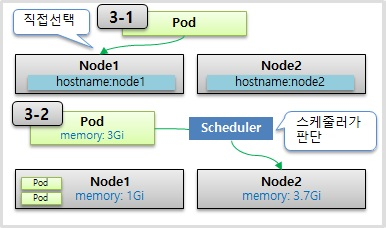

# Pod - Container, Label, NodeSchedule

---

### 1. Container

---

- Pod 안에는 하나의 독립적인 서비스를 구동할 수 있는 Container들이 존재한다.

- 각 컨테이너들은 서비스가 연결될 수 있도록 포트를 갖고 있다.

  - 한 컨테이너가 포트를 하나 이상 가질 수 있지만,
  - 한 파드 내에서 컨테이너들끼리 같은 포트를 가질 수는 없다.

- pod가 생성될 때 고유한 IP주소가 할당되는데, 쿠버네티스 클러스터 내에서만 그 IP를 통해서 해당 pod에 접근이 가능하다.

  -> *외부에서는 접근이 안된다. 즉, 휘발성을 가진 IP이다.*

  

  

  

  ```yaml
  apiVersion: v1
  kind: Pod
  metadata:
    name: pod-1
  spec:
    containers:
    - name: container1
      image: kubetm/p8000
      ports:
      - containerPort: 8000
    - name: container2
      image: kubetm/p8080
      ports:
      - containerPort: 8080
  ```

  


### 2. Label

---

Label은 pod 뿐만 아니라 모든 object에 달 수 있다. 그리고 pod에서 가장 많이 사용한다.

Label을 사용하는 이유는 목적에 따라 object들을 분류하고, 그 분류된 object들만 따로 골라서 연결을 하기 위함이다.

Label의 구성은 key와 value가 한 쌍이며, 하나의 pod에는 여러 개의 label을 달 수 있다.

Label을 잘 달아 놓으면, hash tag를 달아 검색하여 원하는 용도로 사용할 수 있다. 


**Pod**

```yaml
apiVersion: v1
kind: Pod
metadata:
  name: pod-2
  labels:
    type: web
    lo: dev
spec:
  containers:
  - name: container
    image: kubetm/init
```

**Service**

```yaml
apiVersion: v1
kind: Service
metadata:
  name: svc-1
spec:
  selector:
    type: web
  ports:
  - port: 8080
```


### 3. Node Schedule

---

Pod는 결국, 여러 node들 중에 하나의 노드에 올라가져야 한다.

그 방법으로는 **직접 node를 선택하는 방법**과  **k8s가 자동으로 지정하는 방식**이 있다.

직접 선택하는 방법은 pod를 만들 때는, node에 label을 달고 `nodeSelector`란 항목에 node의 label과 매칭되는 key value를`hostname`에 넣어주면 된다.

K8s의 스케줄러에게 맡기는 방식은, `requests`와 `limits`항목을 작성하여 memory와 cpu의 자원의 요구 값과 최대 값을 지정해 준다.

지정한 최대 값(imits)을 초과할 경우, **memory는 바로 pod를 종료**시키지만, **cpu는 request 수치까지 낮추기는 하지만 직접 파드를 종료시키지는 않는다.**



**node를 직접 선택**

```yaml
apiVersion: v1
kind: Pod
metadata:
  name: pod-3
spec:
  nodeSelector:
    kubernetes.io/hostname: k8s-node1
  containers:
  - name: container
    image: kubetm/init
```


**Pod 선택을 스케줄러에게 위임** 

```yaml
apiVersion: v1
kind: Pod
metadata:
  name: pod-4
spec:
  containers:
  - name: container
    image: kubetm/init
    resources:
      requests:
        memory: 2Gi
      limits:
        memory: 3Gi
```


> 자료 출처 : https://kubetm.github.io/practice/beginner/object-pod/