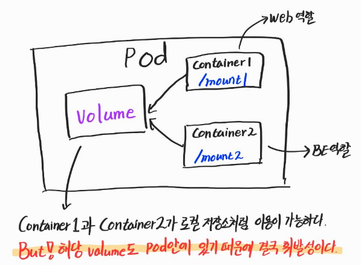
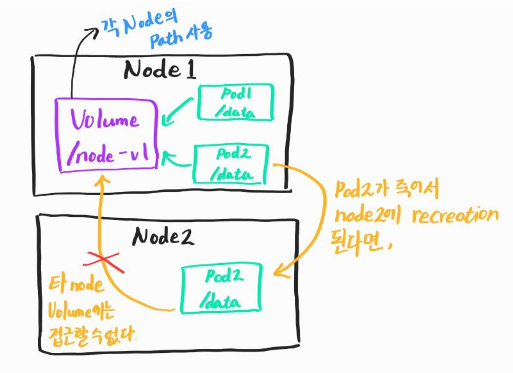
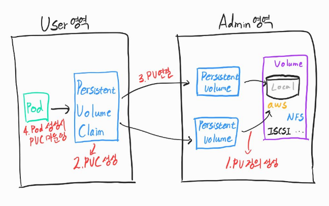

# Volume

---


### 1. EmptyDir

---

컨테이너들끼리 데이터를 공유하기 위해 불륨을 사용하는 것이며 최초 볼륨이 생성될 때, 항상 볼륨이 비어있기 때문에 emptyDir이라는 명칭이 붙었다. 

같은 pod 안에 존재하며 mount된 다른 container들이 로컬 저장소처럼 사용할 수 있기 때문에 컨테이너들 끼리의 파일 공유가 필요없이 편하게 사용할 수 있다.

하지만 볼륨 또한 pod안에 존재하기 때문에 pod에 문제가 생겨 재생성될 때 사라진다.

그래서 **반드시 일시적인 사용목적의 데이터만 넣는 것이 좋다.**




**Pod**

```yaml
apiVersion: v1
kind: Pod
metadata:
  name: pod-volume-1
spec:
  containers:
  - name: container1
    image: kubetm/init
    volumeMounts:
    - name: empty-dir
      mountPath: /mount1 #path를 설정해준다.
  - name: container2
    image: kubetm/init
    volumeMounts:
    - name: empty-dir
      mountPath: /mount2 #path의 이름이 container마다 달라도 관없다.
  volumes:
  - name : empty-dir
    emptyDir: {}
```


### 2. HostPath

---

이름 그대로 한 host, 즉 pod들이 올라가져 있는 node의 path를 volume으로써 사용한다.

이전 emptyDir 방식과는 다른 점이 **vloume의 path가 pod 외부에 존재한다는 것**이다.

Pod들이 죽어도 볼륨은 죽지않고 유지가 된다.

하지만 pod들 입장에서는 node로 부터 자유롭게 생성되는 것을 지향한다.

Node1에 존재하던 pod가 모종의 이유로 죽었다가 재생성될 때, node1에 그대로 생성된다는 보장은 없다. 

재생생되는 순간에 스케줄러의 판단에 의해 다른 node2에 pod를 생성할 수 있으며 그럴 경우 다른 node에 있는 pod는 volume에 마운트가 불가능하다.

굳이 방법을 찾자면 node들 간의 볼륨들의 패스를 똑같이 생성하여 연결을 시켜줌으로써  해결할 수 있지만 좋은 방법은 아니다.

Node가 추가될 때마다 사용자가 직접 mount를 해줘야하는 번거로움이 있다.

각각의 노드에서 사용하는 파일들(시스템 파일이나 설정 파일 등)을 사용할 때 유용하다.

즉, **node에 있는 데이터들을 pod에서 사용하기 위한 용도**라고 생각하면 편하다.





**Pod**

```yaml
apiVersion: v1
kind: Pod
metadata:
  name: pod-volume-3
spec:
  nodeSelector:
    kubernetes.io/hostname: k8s-node1
  containers:
  - name: container
    image: kubetm/init
    volumeMounts:
    - name: host-path
      mountPath: /mount1
  volumes:
  - name : host-path
    hostPath:
      path: /node-v
      type: DirectoryOrCreate
```

추가로, hostPath는 pod가 생성되기 전에 만들어져 있어야만 pod를 생성할 때 에러가 나지 않는다. 


### 3. PVC /PV

---

위 두 가지 방법들은 pod 또는 node가 죽어버릴 시 데이터를 보존할 수 없다.

PVC와 PV는 데이터의 영속성있는 볼륨을 제공하기 위한 방법이다.

로컬 볼륨 스토리지나 aws의 ebs와 같이 영구적으로 저장 가능한 볼륨 스토리지를 지정한 후, persistent volume을 연결한다.

하지만 pod는 PV와 바로 연결을 하지 않고 PVC(Persistent Volume Claim)을 중간 매개체로 연결이 된다.

왜 PV로 다이렉트 연결을 하지 않고 PVC의 중계를 통해 연결하는 걸까?

쿠버네티스는 볼륨 사용에 있어서 **user 영역**과 **admin 영역**으로 나눈다.

Admin영역은 쿠버네티스를 담당하는 운영자의 영역이고,

User 영역은 pod를 사용하며 서비스를 만들고 배포하는 서비스 담당자의 영역이다.

볼륨들의 종류는 많고 각각의 볼륨들과 연결하기 위한 설정들도 모두 다르다.

K8s 운영자가 PV와의 연결을 마치면, 서비스 생성자는 PVC를 통해 간단하고 일관된 방식으로 연결할 수 있으며 서비스 개발에 더 집중할 수 있다.

  



**Persistent Volume**

```yaml
apiVersion: v1
kind: PersistentVolume
metadata:
  name: pv-03
spec:
  capacity:
    storage: 2G
  accessModes:
  - ReadWriteOnce
  local:
    path: /node-v
  nodeAffinity:
    required:
      nodeSelectorTerms:
      - matchExpressions:
        - {key: kubernetes.io/hostname, operator: In, values: [k8s-node1]}
```

**Persistent Volume Clain**

```yaml
apiVersion: v1
kind: PersistentVolumeClaim
metadata:
  name: pvc-04
spec:
  accessModes:
  - ReadWriteOnce
  resources:
    requests:
      storage: 1G
  storageClassName: ""
```

**Pod**

```yaml
apiVersion: v1
kind: Pod
metadata:
  name: pod-volume-3
spec:
  containers:
  - name: container
    image: kubetm/init
    volumeMounts:
    - name: pvc-pv
      mountPath: /mount3
  volumes:
  - name : pvc-pv
    persistentVolumeClaim:
      claimName: pvc-01
```


> Reference : https://kubetm.github.io/practice/beginner/object-volume/