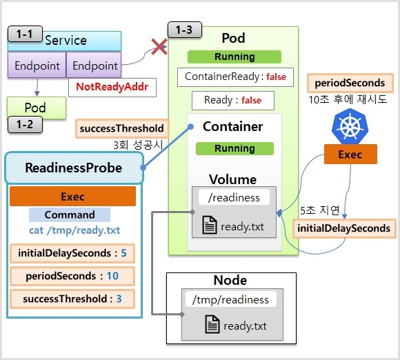

# Pod - Lifecycle

---

### 1. Readiness probe

---



**1-1) Service**

```yaml
apiVersion: v1
kind: Service
metadata:
  name: svc-readiness
spec:
  selector:
    app: readiness
  ports:
  - port: 8080
    targetPort: 8080
```


**1-2) Pod**

```yaml
apiVersion: v1
kind: Pod
metadata:
  name: pod1
  labels:
    app: readiness  
spec:
  containers:
  - name: container
    image: kubetm/app
    ports:
    - containerPort: 8080	
  terminationGracePeriodSeconds: 0
```

```bash
while true; do date && curl 10.97.190.80:8080/hostname; sleep 1; done
```

**1-3) Pod**

```yaml
apiVersion: v1
kind: Pod
metadata:
  name: pod-readiness-exec1
  labels:
    app: readiness  
spec:
  containers:
  - name: readiness
    image: kubetm/app
    ports:
    - containerPort: 8080	
    readinessProbe:
      exec:
        command: ["cat", "/readiness/ready.txt"]
      initialDelaySeconds: 5
      periodSeconds: 10
      successThreshold: 3
    volumeMounts:
    - name: host-path
      mountPath: /readiness
  volumes:
  - name : host-path
    hostPath:
      path: /tmp/readiness
      type: DirectoryOrCreate
  terminationGracePeriodSeconds: 0
```

```bash
kubectl get events -w | grep pod-readiness-exec1
kubectl describe pod pod-readiness-exec1 | grep -A5 Conditions
kubectl describe endpoints svc-readiness
touch ready.txt
```

