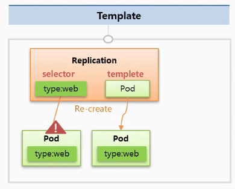
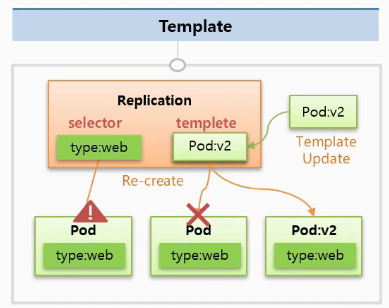
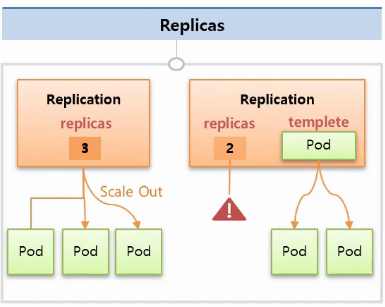
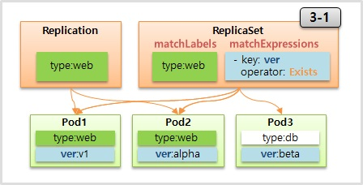
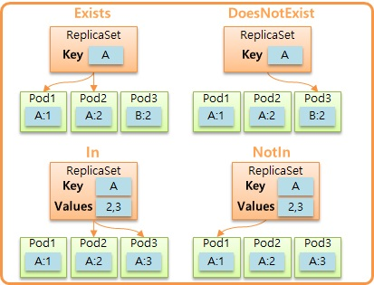

# Controller - Replication Controller & Replica Set

---


일단 Replication Controller는 현재 deprecated한 방식이다. 그 대체제로 나온 것이 replica set이다.

목적은 pod들의 갯수를 일정한 수로 유지시켜주는 것이 주다.

기능은 크게 **template, replicas, selector**가 존재하는데 selector는 replica set에만 존재하는 기능이다.


### 1. Template

---

기본적으로 controller와 pod는 service와 pod처럼 label과 selector로 연결이 된다.

하지만 기존 연결된 pod에 문제가 발생하여 죽어버리고 re-create 해야할 경우 새로 만들어질 pod의 스펙을 정의하는 것이 template의 역할이다.



**Pod**

```yaml
apiVersion: v1
kind: Pod
metadata:
  name: pod1
  labels:
    type: web
spec:
  containers:
  - name: container
    image: kubetm/app:v1
  terminationGracePeriodSeconds: 0
```


**ReplicaSet**

```yaml
apiVersion: apps/v1
kind: ReplicaSet
metadata:
  name: replica1
spec:
  replicas: 1
  selector:
    matchLabels:
      type: web
  template:
    metadata:
      name: pod1
      labels:
        type: web
    spec:
      containers:
      - name: container
        image: kubetm/app:v1
      terminationGracePeriodSeconds: 0
```


이러한 특성을 이용해서 pod의 버전 업그레이드도 가능하다.

V1의 pod가 기존에 연결된 pod라고 할 때, v2로 업그레이드를 해야하는 상황이라면 replication 내에 있는 template을 v2로 수정한 뒤, 연결된 v1 pod를 끊어버리면 된다.

그렇게 된다면 컨트롤러의 pod를 재생성하려는 특성 때문에 v2의 pod들이 새로 만들어진다.




### 2. Replicas

---

Replication controller에 설정한 replicas의 수만큼 pod가 설정이 된다.

수를 늘리면 그만큼 pod들이 scale out되며, 파드를 삭제해도 컨트롤러가 replicas의 갯수만큼 다시 파드를 만들어서 채운다.

또한 위의 template 기능을 사용하면 각가의 pod를 생성하지 않아도 설정한 템플릿의 스펙대로 replicas의 갯수만큼 자동으로 pod들이 생성된다. 



```yaml
apiVersion: v1
kind: ReplicationController
metadata:
  name: replication1
spec:
  replicas: 2
  selector:
    cascade: "false"
  template:
    metadata:
      labels:
        cascade: "false"
    spec:
      containers:
      - name: container
        image: kubetm/app:v1
```


### 3. Selector

---

여기서부터는 replication controller와 replica set이 차이를 보인다.

Replication Controller에 있던 selector는 key와 label이 같은 pod들과 연결을 해주고 키와 벨류 중 하나라도 다르면 연결을 해주지 않는다.

반면 replica set에서는 두 가지 추가적인 속성이 있는데, 

*matchLabels*라는 속성은 replication controller에서의 셀럭터처럼 키와 라벨 모두가 같아야 연결을 해주는 특징이 있고,

*matchExpressions*라는 속성은 key와 value를 좀 더 디테일하게 통제를 할 수 있다.

(둘 다 하나의 selector에서 사용이 가능하다!)



**ReplicaSet**

```yaml
apiVersion: apps/v1
kind: ReplicaSet
metadata:
  name: replica1
spec:
  replicas: 1
  selector:
    matchLabels:
      type: web
      ver: v1
    matchExpressions:
    - {key: type, operator: In, values: [web]}
    - {key: ver, operator: Exists}
  template:
    metadata:
      labels:
        type: web
        ver: v1
        location: dev
    spec:
      containers:
      - name: container
        image: kubetm/app:v1
      terminationGracePeriodSeconds: 0
```


**Pod**

```yaml
apiVersion: v1
kind: Pod
metadata:
  name: pod-node-affinity1
spec:
  affinity:
    nodeAffinity:
      requiredDuringSchedulingIngnoredDuringExecution:
        nodeSelectorTerms:
        - matchExpressions:
  	       - {key: AZ-01, operator: Exists}
  containers:
  - name: container
    image: kubetm/init
```


**MatchExpression**에서 더 디테일한 설정이란, key 값을 기준으로 네 가지 설정이 가능하다.

*Exists* : 정해진 key가 존재하는 pod들을 모두 연결한다.

*DoseNotExist* : 정해진 key가 존재하지 않는 pod들을 모두 연결한다.

*In* : key와 value를 설정하여 key값이 일치하는 pod들 중 values 값을 포함한 pod들을 연결한다.

*NotIn* : In과 반대로 key는 일치하지만 values에 값이 없는 pod들을 연결한다.




이렇듯 replica set에서는 replication controller에서 제공하는 기능을 포함하는 것은 물론이고 추가 적인 기능들이 있다. 상위호환이다.

Replica set을 사용하자.