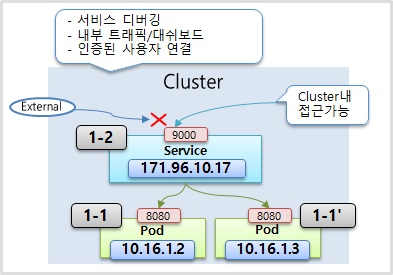
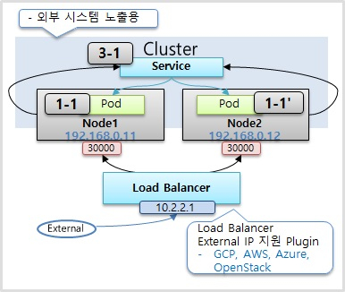

# Service

---


서비스는 기본적으로 cluster 내부에서 사용하는 고유의 IP를 갖고 있다. 그리고 서비스를 pod에 연결시켜 놓으면 해당 서비스를 통해 pod에 연결이 가능하다.

하지만 pod에서도 클러스터 내에서 접근할 수 있는 ip가 존재한다.

굳이 service를 달아 접근하는 이유는 pod를 쿠버네티스에서 시스템, 성능 등의 장애로 언제든 죽을 수 있는 존재로 취급하기 때문이다. 재생성된 pod의 IP는 그때마다 바뀌기 때문에 신뢰성이 떨어진다.

서비스는 사용자가 삭제하지 않는 이상 없어지거나 재생성되지 않는다. 그렇기 때문에 서비스로 접근한다면 언제나 pod에 안정적으로 접근이 가능하다.

서비스의 종류는 여러가지가 있고, 그 종류에 따라 pod에 접근하는 방식이 다르다.

그 중 가장 기본적인 방식은 **cluster IP**를 사용하여 접근하는 것이다.


### 1.  Cluster IP

---

**Cluster IP**는 쿠버네티스 클러스터 내에서만 접근이 가능하다. Pod의 IP처럼 클러스터 내부에 있는 모든 object들이 접근이 가능하지만 외부에서는 접근할 수 없다.

하나의 서비스는 여러개의 pod와 연결이 가능하며 트래픽을 전달하는 역할을 한다.




**Pod**

```yaml
apiVersion: v1
kind: Pod
metadata:
  name: pod-1
  labels:
     app: pod
spec:
  nodeSelector:
    kubernetes.io/hostname: k8s-node1
  containers:
  - name: container
    image: kubetm/app
    ports:
    - containerPort: 8080
```

**Service**

```yaml
apiVersion: v1
kind: Service
metadata:
  name: svc-1
spec:
  selector:
    app: pod
  ports:
  - port: 9000 #service에 들어온 포트
    targetPort: 8080 # 타겟이 되는 pod의 포트
  type: ClusterIP # default가 cluster IP이기 때문에 생략해도 상관 없다.
```


### 2. NodePort

---

NodePort타입의 서비스에도 기본적으로 cluster IP가 할당이 되며, cluster IP 타입과 같은 기능이 포함되어 있다.

노드타입 만의 특징은 **쿠버네티스 클러스터에 연결이 되어 있는 모든 노드에 똑같은 포트가 할당이 돼서  외부로부터 어느 노드든 간에 해당 IP에 포트로 접속을 하면 service에 연결이 된다**.

서비스는 자신의 기본 역할인 자신에게 연결된 pod에 트래픽을 전달해준다.

서비스가 연결된 pod가 있는 노드에만 포트가 생성되는 것이 아닌, **모든 노드에 포트가 만들어진다.**


 


**Service**

```yaml
apiVersion: v1
kind: Service
metadata:
  name: svc-2
spec:
  selector:
    app: pod
  ports:
  - port: 9000
    targetPort: 8080
    nodePort: 30000 # 30000~32767에서만 포트 지정 가능. 생략하면 그 안에서 자동 지정.
  type: NodePort
  externalTrafficPolicy: Local # 특정 Node로 외부에서 접근을하면, 해당 node 안에 있는 pod에게만 서비스가 트래픽을 전달한다.
```


### 3. Load Balancer

---

Load balancer 타입으로 서비스를 만들 경우, 앞에서 서술한 nodePort의 특성을 모두 갖는다.

추가적으로 `load balancer`가 생겨서 각각의 node에 트래픽을 분산시키는 역할을 한다. 

하지만 외부에서 접근할 수 있는 load balancer의 IP는 k8s에서 기본적으로 제공되지 않는다.

추가 플러그인 등을 통해 생성해주어야 한다. (Aws, GCP, Azure 등의 클라우드 플랫폼에는 플러그인을 기본 제공한다)



**Service**

```yaml
apiVersion: v1
kind: Service
metadata:
  name: svc-3
spec:
  selector:
    app: pod
  ports:
  - port: 9000
    targetPort: 8080
  type: LoadBalancer
```


### 4. 정리

---

기본적인 세 가지 서비스 타입 외에도 서비스는 여러가지 용도로 쓰인다. 추후에 여유가 된다면 추가 포스팅을 할 예정이다.

쓰이는 상황에 대해 정리하자면,

**Cluster IP**타입의 서비스는 

- 외부에서 접근을 허용안하며, 클러스터 내에서만 사용하는 IP이다.
- 그렇기 때문에 해당 IP에 접근할 수 있는 대상은 운영자와 같은 인가된 사람 뿐이다.
- 주된 작업은 k8s 대시보드를 관리하거나, 각 파드를 관리하는 용도로 쓰인다.

**NodePort**타입의 서비스는

- 물리적인 호스트의 IP를 통해서 파드에 접근을 할 수 있다.
- 대부분의 호스트 IP는 내부망에서만 접근할 수 있게 네트워크를 구성한다.
- 따라서 노드포트는 클러스터 밖에는 있지만, 내부망 안에서 접근을 해야할 때 쓰인다.
- 내부적으로 개발을하다가, 외부에 간단한 데모를 보여줘야할 때처럼 일시적 외부 연동에도 쓰인다.

**Load Balancer**타입의 서비스는

- 실제적으로 외부에 서비스를 노출시킬 때 이용한다.
- 내부 IP를 노출하지 않고 외부 IP만으로 안정적으로 서비스를 노출시킬 수 있다.
- 즉, 외부에 시스템을 노출시킬 때 쓰인다.

 

> 자료출처 : https://kubetm.github.io/practice/beginner/object-service/