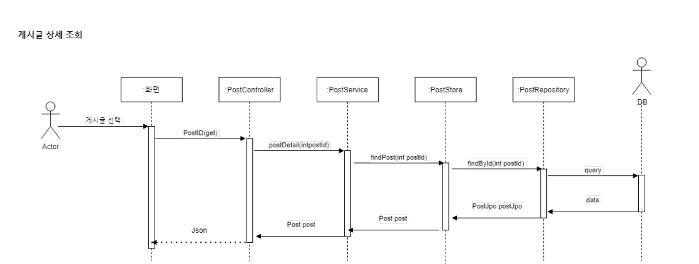

# JPA를 사용한 Spring boot의 구조

### 1. 기본구조

- :file_folder:myJpaExampleProject

  - **MyJpaExampleProjectApplication.java**

- :file_folder:myJpaExampleProject/controller

  - **PostController.java**

- :file_folder:myJpaExampleProject/domain
  
  - **Post.java**

  - :file_folder:myJpaExampleProject/service

    - **PostService.java**
 
- :file_folder:myJpaExampleProject/store

   - **PostStore.java**

- :file_folder:myJpaExampleProject/repository

  - **PostRepository.java**

  - **PostJpo.java**

- :file_folder:myJpaExampleProject/runner

  - **DBRunner.java**