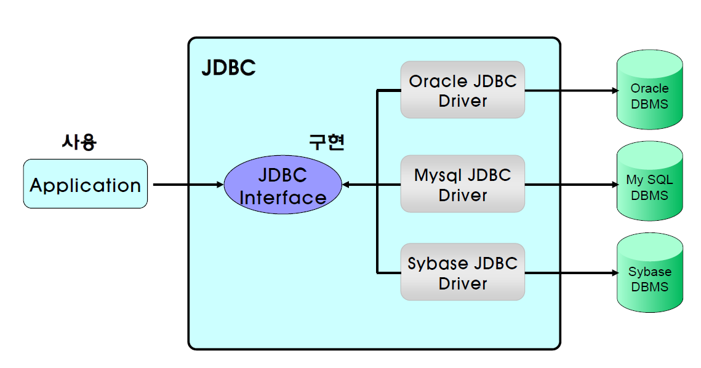
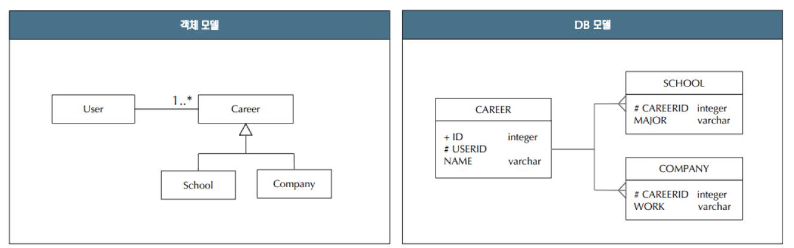
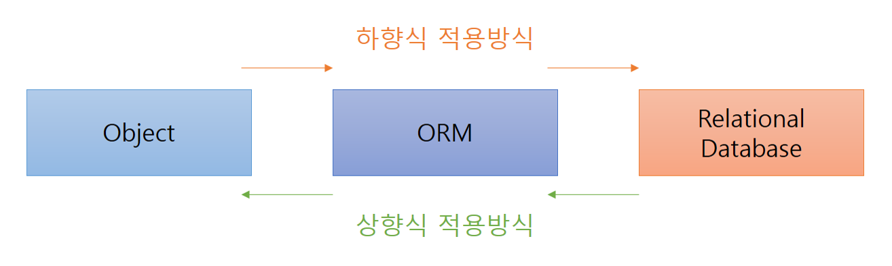

# JPA 개요

<br>

### 1. 영속성(Persistence)

`JPA`는 **Java Persistence API**의 약자다.

문자 그대로 보면 자바 영속성 API란 뜻이다.

- 영속성(persistence)은 사전적인 의미로 '영원히 계속되는 성질이나 능력'을 뜻한다.

- CS로 넘어오면 물리적인 저장소(HDD)에 데이터를 저장하는 행위,

- Java에서는 SQL을 통해 RDBMS에 데이터를 저장하는 행위를 영속화라 표현하기도 한다.

자바에서는 직접적으로 DB의 프로토콜을 사용하는 대신 JDBC 인터페이스를 사용한다.



JDBC 인터페이스는 자바와 데이터베이스를 연결하기 위한 기능을 제공한다.

각 DB 벤더들(Oracle, My Sql 등)은 JDBC 인터페이스에 끼워 맞추어 드라이브를 구현하고 제공한다.

때문에 DBMS에 종속되지 않고 자바 언어로 유연하로 DB에 접근할 수 있다.


<br>

### 2. 패러다임의 불일치(객체지향모델 vs 관계형모델)
<hr>

`패러다임`이라 하면 대략적으로 **사물에 대한 이론적인 틀이나 쳬계**를 의미한다.

자바에서 제공하는 객체지향 어플리케이션과 관계형 DB는 서로의 목표가 다르므로 패러다임의 불일치가 발생한다.

| 객체지향모델 | 관계형모델 |
| ---------- | ---------- |
| 객체, 클래스 | 테이블, 로우 |
| 속성(attribute, property) | 컬럼 |
| Identity | Primary Key |
| Relationship / 다른 Entity 참조 | Foreign Key |
| 상속/다형성 | 없음 |
| 메소드 | SQL 로직, SP, 트리거 |
| 코드의 이식성 | 벤더 종속적임 |

`객체지향`과 `RDB`의 패러다임 불일치 문제는 어플리케이션 개발의 어려움으로 이어진다.

특히 위의 표에서처럼 **상속/다형성**은 RDB에서는 존재하지 않는 개념이다. 

그래서 객체들의 상속을 관계형 모델에서는

- 하위 클래스 별로 테이블을 구성하거나,

- 모든 필드 값을 한 테이블에 모아서 테이블을 구성하거나,

- 추상클래스와 하위 클래스를 개별 테이블로 구성한다.



또한 객체 모델에서의 객체 참조(reference)는 방향성을 가지지만 RDB 모델에서는 방향성이 없거나,

M대N 관계를 객체끼리는 바로 맺을 수 있지만, RDB 모델에서는 새로운 테이블을 생성하는 등

패러다임의 불일치가 발생하며 이는 개발에 굉장히 거슬리는 요소가 된다.

우리는 이것을 해결할 수 있는 방법이 필요하다.

<br>

### 3. ORM의 개념
---

`ORM(Object-relational mapping)`은 위와 같은 패러다임의 불일치를 해소하고 `객체`와 `관계`를 맵핑해주는 중재자 역할을 해준다.

ORM 적용 방식으로는

- 객체 모델을 중심으로 설계하는 `하향식` 적용 방법과
- DB 스키마와 모델을 가지고 설계하는 `상향식` 적용 방법이 있다.



`하향식` 적용방식은
- 맵핑 메타데이터를 XML이나 자바코드에 `어노테이션`을 추가하는 방법으로 구분되며,
- SQL은 코드 생성 도구를 통해 `컴파일 타임`이나 `런타임`에 생성된다.

`상향식` 적용방식은
- 역공학 도구를 활용해 데이터베이스에서 메타데이터를 추출,
- hbc2hbcxml을 사용하여 `XML맵핑 파일`을 생성하고, hbm2java를 사용하여 영속 클래스를 생성.
- 하지만 클래스 간 연관관계에 관한 세부사항과 자바 관련된 메타 정보를 전부 생성할 수 없어 추가 작업이 필요하다.

대충 봐도 하향식 적용방식이 더 간단하고 쉬워보인다. 또한 어노테이션을 추가하여 맵핑 메타데이터를 통제하는 방식이 기존의 `Spring`에서 사용하는 그것과 유사하다.

<br>

### 4. ORM이 제공해야 하는 기능
---

- 메타 데이터를 사용하여 객체와 테이블 사이의 맵핑 정보를 지정할 수 있어야 한다.

- 클래스의 상속, 객체 사이의 연관 등의 객체 모델링을 지원해야 한다.

- 클래스와 클래스의 프로퍼티를 사용하여 객체를 조회할 수 있어야 한다.

- 객체 값 변경을 자동으로 데이터베이스에 반영해야 하고, 상황에 따라 성능을 개선할 수 있는 방법을 제공해야 한다.

<br>

### 5. 그래서 JPA가 무엇이냐면
---

JPA는 여러 ORM의 전문가들이 뛰어들어 만든 **JavaSE, JavaEE를 위한 공식적인 ORM 표준 기술이다.**

Hibernate, OpenJPA, EclipseLink, TopLink Essentials과 같은 구현체가 있고 이것을 표준화된 방식으로 제공하는 인터페이스가 JPA이다.

덕분에 Java에서 객체지향적으로 데이터를 관리할 수 있게 되었고 **로직을 객체지향에 집중할 수 있기 때문에** 개발 효율을 향상시킨다.

아래는 JDBC를 사용하여 RDB에 접근한 것과, JPA를 통해 접근하는 코드의 차이이다.

```java
 //JDBC 예제

public User findUserByUserId(StringuserId) throws SQLException{
    
    User user = new User();
    Connection conn = null;
    PreparedStatement psmt = null;
    ResultSet rs = null;
    
    try{
        conn = DriverManager.getConnection(URL,USER,PASS);
        psmt = conn.prepareStatement("select * from users where id=?");
        psmt.setString(1,ids.trim());
        rs = psmt.executeQuery();
        while(rs.next()){
            inti=1;
            user.setId(rs.getString(i++).trim());
            user.setName(rs.getString(i++).trim());
            user.setAddr(rs.getString(i++).trim());
        }
    }catch(SQLExceptione){thrownewSQLException(e);
    }finally{
            if(rs!=null){try{rs.close();}catch(SQLExceptione){}}
            if(psmt!=null){try{psmt.close();}catch(SQLExceptione){}}
            if(conn!=null){try{conn.close();}catch(SQLExceptione){}}
    }
    return dto;
}
``` 

```java
//JPA 예제

public User findUserByUserId(StringuserId){
    Entity Managerem = JpaUtil.getEntityManagerFactory().createEntityManager();
    Entity Transactiontx = em.getTransaction();
    tx.begin();
    User foundUser = em.find(User.class,userId);
    tx.commit();
    em.clear();
    return foundUser;
}
```

왜 쓰는지 알거같다.


<br>
<br>

> 참고 사이트 : https://blog.woniper.net/255