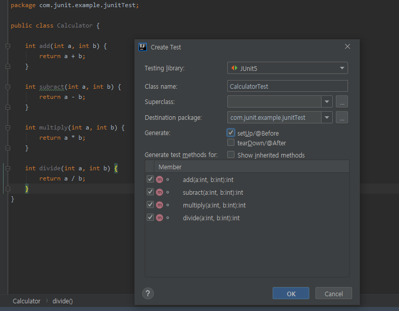
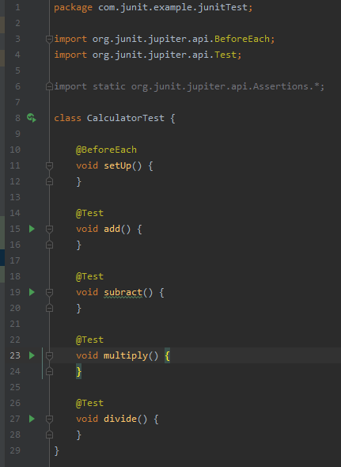
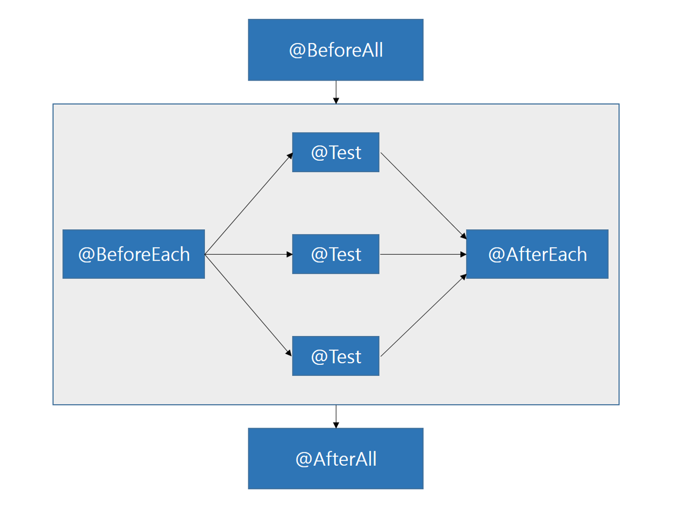
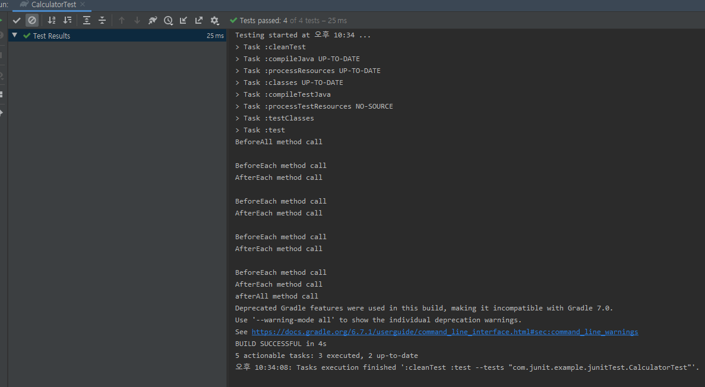

# JUnit을 사용한 기본 테스트 코드

<br>

### 1. JUnit 개요

스프링 프레임워크를 사용하거나 다른 어플리케이션을 개발할 때, 여러 객체와 로직들이 복합적으로 얽혀있는 경우가 대다수다.

예를 들어 REST API로 요청을 받아 DB에 저장하는 경우, 외부로부터 입력을 받아 그 결과물 또한 외부로 나타난다.

 때문에 코드가 잘 돌아가는지 확인하기 위해서는 그 흐름을 모두 완성하여 입출력을 확인하고 코드가 수정될 때마다 서버를 재시작해야 하는 번거로움이 있다.

이게 개발하는 도중에 여간 귀찮은 일이 아니다. 

`JUnit`은 모듈이나 애플리케이션 안에 있는 개별적인 코드 단위가 예상대로 작동하는지 확인하는지, 즉 단위 테스트를 도와주기 위한 자바의 xUnit 프레임워크이다.

**xUnit** 프레임워크는 가장 대중적인 테스트프레임워크로 개발환경(x)에 따라 Unit(단위) 테스트를 도와주 는도구이다.

`C++`은 **CppUnit** , `.net`은 **NUnit** 이런식으로.

JUnit의가장 최신 버전은 JUnit5로 스프링 부트 2.2.X 이후 버전부터는 JUnit5를 기본적으로 제공한다. JUnit5를 사용하기 위해서는 최소한 **JDK8** 버전 이상을 사용해야한다.

JUnit4로 다운 그레이드하기 위해서는 별도로 build 파일을 설정해주어야 한다.

본 게시글은 JUnit5로 실습을 진행할 것이다.


<br>

### 2. 단위 테스트 vs TDD

스프링부트 스터디를 할 때, JUnit을 처음 접했다.

한창 취준에 환장하고 있던 나는 'JUnit 쓰면 면접에서 TDD 써봤다고 말할수 있어요?'라고 물었었는데 현직자들이 봤을 때 좀 우스웠을거 같다.

결론부터 말하면 **TDD와 단위테스트는 다른 이야기이다.**

TDD는 테스트 주도 개발로 **테스트 코드를 먼저 작성하는 것**부터 시작한다.

아래는 TDD를 설명할 때 자주 쓰이는 레드 그린 사이클이다.

<br>


1. 항상 실패하는 테스트를 먼저 작성하고(RED)

2. 테스트가 통과하는 프로덕션 코드를 작성하고(Green)

3. 테스트가 통과하면 프로덕션 코드를 리팩토링한다.(Refactor)

<br>

반면 단위 테스트는 TDD의 첫 번째 단계인 **기능 단위의 테스트 코드를 작성**하는 것을 이야기한다. TDD와 달리 테스트 코드를 꼭 먼저 작성해야 하는 것도 아니고  리펙토링도 포함되지 않는다. 

즉, TDD와 단위테스트는 별개의 것이고, TDD의 과정 중 단위 테스트가 포함될 수 있다.
그리고 `JUnit`은 단위 테스트를 위한 도구이다.

TDD에 관한 자세한 내용은 기회가 될 때 다시 써보기로 하자.

<br>

### 3. 단위 테스트의 이점

- 개발단계 초기에 문제를 발견하게 도와준다.

- 개발자가 나중에 코드를리팩토링하거나 라이브러리 업그레이드 등에서 기존 기능이 올바르게 작동하는지 확인할 수 있다. (예.  회귀 테스트)

- 기능에 대한 불확실성을 감소시킬 수 있다.

- 시스템에 대한 실제 문서를 제공한다. 즉, 단위 테스트 자체가 문서로 사용할 수 있다.

<br>

### 4. JUnit5를 활용한 기본 테스트

기본적인 사칙연산을 수행하는 Calculator 클래스를 만들고 JUnit5을 통한 단위 테스트를 진행한다.

먼저 Calculator 클래스를 작성해준다.

```java
package com.junit.example.junitTest;

public class Calculator {

    int add(int a, int b) {
        return a + b;
    }

    int subtract(int a, int b) {
        return a - b;
    }

    int multiply(int a, int b) {
        return a * b;
    }

    int divide(int a, int b) {
        return a / b;
    }
}
```

`intellij` 에서는 `Ctrl + Shift + t`를 사용하여 쉽게 테스트 파일을 생성할 수 있다. 

생성한 네 개의 메소드들을 모두 체크하고 setUp/@Before에 체크를 하여 사전 메소드를 만들어준다.




<br>

그럼 아래와 같이 디폴트 테스트 클래스가 생성된다.




`Calculator` 클래스에 존재하는 네 개의 메소드들이 테스트 메소드로 생성이 되었고 아까 Setup에 채크를 해줌으로써 `@BeforeEach` 어노테이션을 달고 있는 setUp 메소드가 만들어 졌다.

JUnit4에서도 그랬듯이 JUnit5에서도 라이프사이클 메소드가 존재한다.


- **@BeforeAll** : 테스트 클래스 시작 시 한 번만 호출한다.

&nbsp; &nbsp; &nbsp; &nbsp; &nbsp; &nbsp;
 *JUnit4에서 @BeforeClass와 같은 역할*

- **@BeforeEach** : 각 테스트 메소드가 실행되기 전 실행한다.

&nbsp; &nbsp; &nbsp; &nbsp; &nbsp; &nbsp;
 *JUnit4에서 @Before와 같은 역할*

- **@AfterAll** : 테스트 클래스의 모든 테스트 완료 시 한 번만 호출한다.

&nbsp; &nbsp; &nbsp; &nbsp; &nbsp; &nbsp;
 *JUnit4에서 @AfterClass와 같은 역할*

- **@AfterEach** : 각 테스트 메소드가 실행된 후 실행한다.

&nbsp; &nbsp; &nbsp; &nbsp; &nbsp; &nbsp;
 *JUnit4에서 @After와 같은 역할*

 전체적인 라이프사이클은 
 > BeforeAll -> BeforeEach -> Test -> AfterEach -> AfterAll 
 
 순서로 진행된다.

 


<br>

실제 코드로 작성하여 테스트를 진행해보면,

 ```java
 package com.junit.example.junitTest;

import org.junit.jupiter.api.*;

import static org.junit.jupiter.api.Assertions.*;

class CalculatorTest {

    private Calculator cal;

    @BeforeAll
    static void beforeAll() {
        System.out.println("BeforeAll method call");
    }

    @BeforeEach
    void setUp() {
        cal = new Calculator(); // 각 테스트 실행 전 초기화 된다.
        System.out.println();
        System.out.println("BeforeEach method call");
    }

    @Test
    void add() {
        assertEquals(12, cal.add(10,2));
    }

    @Test
    void subtract() {
        assertEquals(8, cal.subtract(10,2));
    }

    @Test
    void multiply() {
        assertEquals(20, cal.multiply(10,2));
    }

    @Test
    void divide() {
        assertEquals(5, cal.divide(10,2));
    }

    @AfterEach
    void afterEach() {
        System.out.println("AfterEach method call");
    }

    @AfterAll
    static void afterAll() {
        System.out.println("afterAll method call");
    }
}
```

아래와 같은 예상된 결과가 나온다.




이렇게 간단한 JUnit5 테스트 코드를 작성하여 결과를 확인하였다.

아직 Spring-Test와 연계하지도 않고 기타 기능들을 설명 없이 간단하게 맛보기만 한 정도다.

추후 포스팅에서 조금 더 구체적으로 JUnit5에 대해 작성해보겠다.