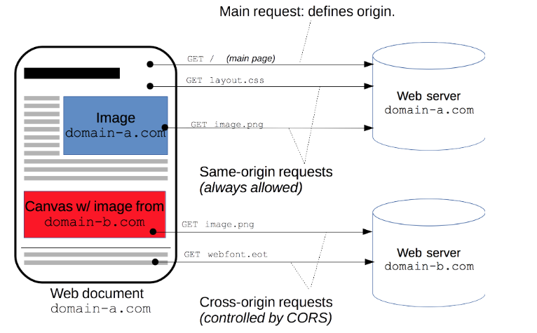

# CORS에 관한 간단한 정리

외부 API를 이용하면서 종종 부딪히곤 했었던 CORS 문제를 공부해볼까 하던 찰나에 잘 정리된 유튜브가 있어서 그것을 정리해볼까 한다.

> https://www.youtube.com/watch?v=yTzAjidyyqs

Taehoon님의 유튜브인데 굉장히 설명을 잘하시고 목소리도 좋으셔서 쭉 한 번 보면 좋을 체널이다.

아무튼 CORS를 한마디로 설명하자면 ```이미 한 도메인에서 실행중인 웹 브라우저가 다른 도메인의 자원을 이용할 때 사용하는 매커니즘``` 정도로 볼 수 있다.

<br>

### 1. 단일 도메인 웹
---
예전의 웹 사이트들은 상당수가 하나의 도메인만 필요로 하면 됐다. 
는
사용자가 웹 브라우저 주소창에 url을 입력하고 해당 서버에서는 그에 해당하는 HTML을 반환한다. 

다른 서버를 방문할 필요 없이 하나의 서버에서 비지니스 로직과 HTML 페이지 빌드를 모두 담당하였고 자바스크립트를 활용해 추가 요청을 한다 해도 어차피 하나의 도메인에서 모든 것이 처리가 되었다.

<br>


그렇기 때문에 브라우저에서 기존의 도메인이 아닌 다른 도메인으로 요청을 날린다는 것은 개인정보 유출, 피싱 등의 불법적인 행위가 의심되는 상황이었다.

웹 브라우저는 같은 도메인이 아니면 요청 자체를 막는 선택을 하게 되었고 단일 도메인으로의 접근만 허용하였다.

<br>

### 2. 웹의 발전과 다중 도메인 웹
---
하지만 웹이 발전함에 따라 그 기능은 단순히 html 페이지만 넘기는 것이 아닌 하나의 '어플리케이션'의 역할까지 넘보게 된다.웹

그에 따라 다양한 기능의 외부 API를 사용하기 시작했고 제 2, 3의 도메인으로의 접근이 필요하게 되었다. 

그런 과도기적 상황을 거치면서 기존 웹 브라우저에서 제공하던 단일 도메인 정책이 굉장히 거슬리기 시작한다. 

간단하게 날씨 정보를 확인하는 웹 사이트를 예로 들어보자.

<br>


웹 브라우저에서는 현재 실행중인 도메인이 아닌 다른 도메인은 접근을 차단하므로 기존의 서버를 거쳐서 날씨 API를 받아 와야 한다. 

중간 단계를 반드시 거쳐야하는 번거로움이 있었고 이것을 해결하기 위한 리소스 우회 방법들이 등장했다. 대표적인 예가 JSOP.

하지만 웹 브라우저 입장에서는 우회적인 루트를 그대로 방치할 수도 없는 노릇이었다.

보안적인 측면을 유지해야 했지만 이미 늘어난 우회로들을 모두 버그로 판단하고 막아버리기도 너무 많은 수요가 있었다.

그래서 힘세고 강한 조직 **W3C**에서 공식적으로 멀티 도메인으로의 접근 루트를 열어주게 되는데 그것이 바로 ```CORS```이다.

<br>

### 3. CORS(Cross Origin Resource Sharing)
---

*<center> 출처: https://developer.mozilla.org/ko/docs/Web/HTTP/CORS</center>*

CORS는 브라우저와 서버 간의 안전한 교차 출처 요청 및 데이터 전송을 지원한다.

CORS를 사용하기 위해서는 FE와 서버에서 특정한 작업을 해줘야 한다. 하지만 크게 어렵지 않다.

W3C에서 오피셜하게 내놓은 솔루션이니만큼 대부분의 웹 브라우저, 서버에서 어렵지 않게 사용이 가능하도록 기능을 제공한다.

프론트일 경우에는 ```Request Header```에 CORS 관련 옵션을 넣어주면 되고,

서버에서는 ```Request Header```에 해당하는 프론트의 요청을 허용한다는 내용을 넣어주면 된다. 

헤더에 들어갈 내용은 명확하게 정해져 있고 그것을 그대로 쓰기만 하면 된다.

기존의 도메인과의 통신과의 차이가 있다면 CORS를 이용한 통신은 HTTP의 OPTION 메소드를 사용한다는 점이다.

<br>


*출처: https://developer.mozilla.org/ko/docs/Web/HTTP/CORS*

Cross 도메인 요청을 보내는 작업은 사실 서버로 두 번의 요청을 보낸다. 

먼저 서버에 HTTP OPTION 메소드를 사용해서 해당 요청을 허용해줄 것인지를 물어본다.

그때 서버에서 OK를 하면 GET이나 POST를 메소드를 사용해 실제 요청을 보내고 결과를 받아온다.

따라서 서버 측에서도 동일한 라우트에 대해 이런 OPTION 메소드에 대한 처리를 해줘야 한다. 

대개의 서버 라이브러리가 이런 역할을 처리해주기 때문에 개발할 때 신경쓸 일을 크게 없다.